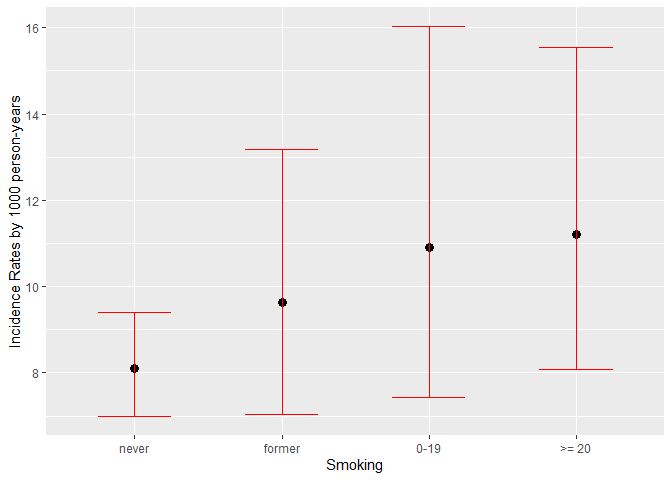

Statistical Methods in Epidemiology
================
Achilleas Stamoulopoulos
10/13/2020

# Lab 1

## Objectives

The aim of this practical is to display how main measures of disease and
effect used in epidemiology are calculated in R.

First, let’s load all the libraries that we are going to use. Make sure
that you have already installed the respective R packages.

``` r
library(tidyverse)
library(gmodels)
library(epiR)
```

## I. Analysis of cohort studies

For this part of the practical we will use data from the Whitehall
study. We’ll store our data in a dataframe called **wha\_data** and
create factors for all the categorical variables.

``` r
wha_data <- read.table("Wha.txt", header = TRUE)
wha_data$group <- factor(wha_data$group, levels = c("1", "2", "3"))
wha_data$work <- factor(wha_data$work, levels = c("high", "low"))
wha_data$smok <- factor(wha_data$smok, levels = c("0", "1", "2", "3"), labels = c("never", "former", "0-19", ">= 20"))
wha_data$all <- factor(wha_data$all, levels = c("1", "0"), labels = c("died", "alive"))
wha_data$IHD <- factor(wha_data$IHD, levels = c("1", "0"), labels = c("IHD", "Other_cause"))
```

Using the `` `r CrossTable` `` function from package **gmodels** we can
examine the distribution of categorical variables, as well as create
contingency tables to examine the relationship between two categorical
variables.

``` r
CrossTable(wha_data$all)
```

    ## 
    ##  
    ##    Cell Contents
    ## |-------------------------|
    ## |                       N |
    ## |         N / Table Total |
    ## |-------------------------|
    ## 
    ##  
    ## Total Observations in Table:  399 
    ## 
    ##  
    ##           |      died |     alive | 
    ##           |-----------|-----------|
    ##           |       278 |       121 | 
    ##           |     0.697 |     0.303 | 
    ##           |-----------|-----------|
    ## 
    ## 
    ## 
    ## 

``` r
CrossTable(wha_data$IHD, wha_data$all, expected = FALSE, prop.r = TRUE, prop.c = TRUE, prop.t = FALSE, prop.chisq = FALSE, dnn = c("Cause of death", "Status"))
```

    ## 
    ##  
    ##    Cell Contents
    ## |-------------------------|
    ## |                       N |
    ## |           N / Row Total |
    ## |           N / Col Total |
    ## |-------------------------|
    ## 
    ##  
    ## Total Observations in Table:  399 
    ## 
    ##  
    ##                | Status 
    ## Cause of death |      died |     alive | Row Total | 
    ## ---------------|-----------|-----------|-----------|
    ##            IHD |       150 |         0 |       150 | 
    ##                |     1.000 |     0.000 |     0.376 | 
    ##                |     0.540 |     0.000 |           | 
    ## ---------------|-----------|-----------|-----------|
    ##    Other_cause |       128 |       121 |       249 | 
    ##                |     0.514 |     0.486 |     0.624 | 
    ##                |     0.460 |     1.000 |           | 
    ## ---------------|-----------|-----------|-----------|
    ##   Column Total |       278 |       121 |       399 | 
    ##                |     0.697 |     0.303 |           | 
    ## ---------------|-----------|-----------|-----------|
    ## 
    ## 

### Risk Analysis

In order to assess the risk of death according to working group and
calculate the risk ratio of the high grade vs. low grade working groups
(as well as some other probably useful measures), we’ll use the `` `r
epi.2by2` `` function from **epiR** package using the argument **method
= “cohort.count”**. Note that this function accepts an object of class
*table*, which means that we have to create it first in order to proceed
(in this case we need a contingency table of status(**variable all**) to
working group(**variable work**)) and furthermore we need to specify
whether the outcome variable lies on rows or columns(argument **outcome
= “as.rows”** or **outcome = “as.columns”**).

``` r
table1 <- with(wha_data, table(all, work))
epi.2by2(table1, method = "cohort.count", outcome = "as.rows")
```

    ##              Exposed +    Exposed -      Total
    ## Outcome +          181           97        278
    ## Outcome -           55           66        121
    ## Total              236          163        399
    ## 
    ## Point estimates and 95% CIs:
    ## -------------------------------------------------------------------
    ## Inc risk ratio                               1.29 (1.11, 1.49)
    ## Odds ratio                                   2.24 (1.45, 3.46)
    ## Attrib risk *                                17.19 (7.92, 26.45)
    ## Attrib risk in population *                  10.16 (1.38, 18.95)
    ## Attrib fraction in exposed (%)               22.41 (10.31, 32.87)
    ## Attrib fraction in population (%)            14.59 (6.07, 22.33)
    ## -------------------------------------------------------------------
    ##  Test that OR = 1: chi2(1) = 13.477 Pr>chi2 = <0.001
    ##  Wald confidence limits
    ##  CI: confidence interval
    ##  * Outcomes per 100 population units

### Incidence Rate Analysis

Due to the fact that we have access to the number of years that every
person lived (variable **y**), we can examine the effect of grade of
work on mortality through an incidence rate analysis. For this purpose,
we need the total number of deaths and the total person-years in both
working groups (high and low). We can extract this information from our
initial dataset with the aid of tools from **Tidyverse** package.

``` r
by_work <- wha_data %>%
  group_by(work) %>%
  summarise(Cases = sum(all == "died"), Person_years = sum(y))
by_work
```

    ## # A tibble: 2 x 3
    ##   work  Cases Person_years
    ##   <fct> <int>        <dbl>
    ## 1 high    181       18648.
    ## 2 low      97       12812.

To perform the incidence rate analysis, again we are going to use `` `r
epi.2by2` `` function. However, this time the argument **method =
“cohort.time”** has to be specified. Also, in this case the function
accepts a *table* with the number of cases in the first column, the
number of person-years in the second and the rows grouped by the
exposure (here variable **work**). Since **py\_data** is an object of
class *data.frame* we have to extract its last two columns (because we
just want the number of cases and the person-years) and create a *table*
from them before we proceed to the incidence rate analysis.

``` r
table2 <- as.table(as.matrix(by_work[,2:3]))
epi.2by2(table2, method = "cohort.time")
```

    ##              Outcome +    Time at risk        Inc rate *
    ## Exposed +          181           18648             0.971
    ## Exposed -           97           12812             0.757
    ## Total              278           31460             0.884
    ## 
    ## Point estimates and 95% CIs:
    ## -------------------------------------------------------------------
    ## Inc rate ratio                               1.28 (1.00, 1.66)
    ## Attrib rate *                                0.21 (0.01, 0.42)
    ## Attrib rate in population *                  0.13 (-0.06, 0.31)
    ## Attrib fraction in exposed (%)               22.00 (-0.36, 39.69)
    ## Attrib fraction in population (%)            14.32 (7.07, 21.57)
    ## -------------------------------------------------------------------
    ##  Wald confidence limits
    ##  CI: confidence interval
    ##  * Outcomes per 100 units of population time at risk

Afterwards, we’d like to examine the effect of smoking status (variable
**smok**) on the risk of death. Smoking status is a categorical variable
with 4 levels. For exposures with more than 2 levels, we can manual
calculate the point estimates for incidence rates for all the levels. In
order to have a picture of how rates are modified among levels of
smoking status and if they have a statistically significant difference
we will create a plot of these point estimates along with their 95%
confidence limits. To calculate the confidence limits, we will use the
normal approximation to the distribution of log of rates.

``` r
by_smok <- wha_data %>%
  group_by(smok) %>%
  summarise(Cases = sum(all == "died"), Person_years = sum(y)) %>% 
  mutate(Inc_Rate = 1000 * Cases/Person_years, 
         lower_l = Inc_Rate/exp(1.96 * sqrt(1/Cases)), 
         upper_l = Inc_Rate*exp(1.96 * sqrt(1/ Cases)))

by_smok
```

    ## # A tibble: 4 x 6
    ##   smok   Cases Person_years Inc_Rate lower_l upper_l
    ##   <fct>  <int>        <dbl>    <dbl>   <dbl>   <dbl>
    ## 1 never    177       21815.     8.11    7.00    9.40
    ## 2 former    39        4050.     9.63    7.04   13.2 
    ## 3 0-19      26        2383.    10.9     7.43   16.0 
    ## 4 >= 20     36        3212.    11.2     8.09   15.5

``` r
ggplot(by_smok, aes(smok, Inc_Rate)) + 
  geom_point(size = 3) + 
  geom_errorbar(aes(ymin = lower_l, ymax = upper_l), color = "red", width = 0.5) +
  ylab("Incidence Rates by 1000 person-years") +
  xlab("Smoking")
```

<!-- -->

## II. Analysis of case-control studies

For this part of the practical we will use data from the case-control
study of HIV infection in Mwanza, Tanzania. We’ll store our data in a
dataframe called **mw\_data** and create factors for our categorical
variables. Note that variable **skin** has one missing value (9) and it
will be converted to *NA* by not including it to the levels of the
factor.

``` r
mw_data <- read.table("mwanza.txt", header = TRUE)
mw_data$case <- factor(mw_data$case, levels = c("1", "0"), labels = c("Cases", "Controls"))
mw_data$ed <- factor(mw_data$ed, levels = c("0", "1", "2", "3"), labels = c("none", "elementary", "medium", "high"))
mw_data$skin <- factor(mw_data$skin, levels = c("1", "0"), labels = c("yes", "no"))
mw_data$work <- factor(mw_data$work, levels = c("1", "2"))
```

First, we’ll examine the difference in education levels in cases and
controls.

``` r
with(mw_data, CrossTable(case, ed, expected = FALSE, prop.r = TRUE, prop.c = TRUE, prop.t = FALSE, prop.chisq = FALSE, dnn = c("HIV", "Education")))
```

    ## 
    ##  
    ##    Cell Contents
    ## |-------------------------|
    ## |                       N |
    ## |           N / Row Total |
    ## |           N / Col Total |
    ## |-------------------------|
    ## 
    ##  
    ## Total Observations in Table:  399 
    ## 
    ##  
    ##              | Education 
    ##          HIV |       none | elementary |     medium |       high |  Row Total | 
    ## -------------|------------|------------|------------|------------|------------|
    ##        Cases |        117 |         24 |         13 |         19 |        173 | 
    ##              |      0.676 |      0.139 |      0.075 |      0.110 |      0.434 | 
    ##              |      0.421 |      0.471 |      0.433 |      0.475 |            | 
    ## -------------|------------|------------|------------|------------|------------|
    ##     Controls |        161 |         27 |         17 |         21 |        226 | 
    ##              |      0.712 |      0.119 |      0.075 |      0.093 |      0.566 | 
    ##              |      0.579 |      0.529 |      0.567 |      0.525 |            | 
    ## -------------|------------|------------|------------|------------|------------|
    ## Column Total |        278 |         51 |         30 |         40 |        399 | 
    ##              |      0.697 |      0.128 |      0.075 |      0.100 |            | 
    ## -------------|------------|------------|------------|------------|------------|
    ## 
    ## 

Then, we’ll calculate the odds of HIV according to education level. As
education has more than 2 levels, we’ll do it manually. We’ll also
calculate 95% confidence limits for odds based on normal approximation
of log of odds.

``` r
by_educ <- mw_data %>% 
  group_by(ed) %>% 
  summarise(Cases = sum(case == "Cases"), Controls = sum(case == "Controls")) %>% 
  mutate(Odds = Cases/Controls, 
         lower_l = Odds/exp(1.96*sqrt((1/Cases)+(1/Controls))), 
         upper_l = Odds*exp(1.96*sqrt((1/Cases) + (1/Controls))))

by_educ
```

    ## # A tibble: 4 x 6
    ##   ed         Cases Controls  Odds lower_l upper_l
    ##   <fct>      <int>    <int> <dbl>   <dbl>   <dbl>
    ## 1 none         117      161 0.727   0.573   0.922
    ## 2 elementary    24       27 0.889   0.513   1.54 
    ## 3 medium        13       17 0.765   0.371   1.57 
    ## 4 high          19       21 0.905   0.486   1.68

Finally, we’d like to examine whether the odds of HIV vary according to
whether the woman has skin incisions or tattoos(variable **skin**). Skin
has two levels, so, once more, `` `r epi.2by2` `` will be our main tool.
Since our data are from a case-control study, we need to specify the
argument **method = “case.control”**. We remind that this function
accepts an object of class *table*.

``` r
table3 <- with(mw_data, table(case, skin))
epi.2by2(table3, method = "case.control", outcome = "as.rows")
```

    ##              Exposed +    Exposed -      Total
    ## Outcome +           76           97        173
    ## Outcome -           73          152        225
    ## Total              149          249        398
    ## 
    ## Point estimates and 95% CIs:
    ## -------------------------------------------------------------------
    ## Odds ratio (W)                               1.63 (1.08, 2.46)
    ## Attrib prevalence *                          12.05 (2.00, 22.11)
    ## Attrib prevalence in population *            4.51 (-3.26, 12.28)
    ## Attrib fraction (est) in exposed  (%)        38.63 (5.67, 60.15)
    ## Attrib fraction (est) in population (%)      17.00 (2.60, 29.27)
    ## -------------------------------------------------------------------
    ##  Test that OR = 1: chi2(1) = 5.509 Pr>chi2 = 0.02
    ##  Wald confidence limits
    ##  CI: confidence interval
    ##  * Outcomes per 100 population units
