Statistical Methods in Epidemiology - Labs 4 & 5
================

# Survival Analysis

In this lab, we will demonstrate the central functions and tools to
perform Survival Analysis in R. Let’s load the libraries that we are
going to use.

``` r
library(biostat3)
library(coin)
library(haven)
library(kableExtra)
library(survival)
library(survminer)
library(tidyverse)
```

Initially we will work with the *colon\_sample* dataset.

``` r
data1 <- read_dta("colon_sample.dta")
```

Variable *surv\_mm* shows the survival of people in months and *status*
indicates whether someone has died from cancer, other reason or is still
alive (coded as 1, 2, 0 respectively). We will consider the people that
are still alive or have died from other reason as right censored and
create the variable *csr\_fail* (coded 0 for right censored and 1 for
those that have died from cancer).

``` r
data1$csr_fail <- ifelse(data1$status == 1, 1, 0)
```

Now, we would like to estimate the survivor function through *life
table* method. Some packages do provide built-in functions for this
purpose (such as `lifetab()` from **KMsurv** package), but we will
display a manual way to construct a life table for this dataset with
extensive use of **Tidyverse** tools. We will consider that every event
(death or censoring) happens in an interval of 12 months (so we will
create 9 intervals). Standard errors of estimated survival are
calculated using **Greenwood’s formula** and **Delta Method**, while
confidence intervals using the normal approximation of the log of
cumulative hazard rate, i.e. the log(-log(S(t))).

``` r
life_table <- data1 %>% 
  mutate(Interval = factor(case_when(surv_mm %in% seq(0, 11, by = 1) ~ 12, 
                                     surv_mm %in% seq(12, 23, by = 1) ~ 24,
                                     surv_mm %in% seq(24, 35, by = 1) ~ 36,
                                     surv_mm %in% seq(36, 47, by = 1) ~ 48,
                                     surv_mm %in% seq(48, 59, by = 1) ~ 60,
                                     surv_mm %in% seq(72, 83, by = 1) ~ 84,
                                     surv_mm %in% seq(84, 95, by = 1) ~ 96,
                                     surv_mm %in% seq(96, 107, by = 1) ~ 108,
                                     surv_mm %in% seq(108, 120, by = 1) ~ 120), 
                           labels = c("0-12", "12-24", "24-36", "36-48", "48-60", "72-84", "84-96", "96-108", "108-120"))
         ) %>% 
  group_by(Interval) %>%
  summarise(Deaths = sum(csr_fail == 1), Lost = sum(csr_fail == 0)) %>%
  mutate(Total = lag(35 - cumsum(Lost + Deaths), default = 35),
         Pr = 1 - Deaths / (Total - Lost/2), 
         Survival = cumprod(Pr), 
         Sums = cumsum(Deaths/((Total - Deaths - Lost/2) * (Total - Lost/2))),
         Std.Error = Survival * sqrt(Sums),
         A = qnorm(0.025, lower.tail = FALSE)*-(1/log(Survival))*sqrt(Sums),
         Lower_L = Survival^exp(A),
         Upper_L = Survival^exp(-A),
         compl_months = c(seq(12, 60, by = 12), seq(84, 120, by = 12))
         ) %>% 
  select(Interval, Total, Deaths, Lost, Survival, Std.Error, Lower_L, Upper_L, compl_months)


life_table %>%
  kbl(digits = 3) %>%
  kable_styling()
```

<table class="table" style="margin-left: auto; margin-right: auto;">

<thead>

<tr>

<th style="text-align:left;">

Interval

</th>

<th style="text-align:right;">

Total

</th>

<th style="text-align:right;">

Deaths

</th>

<th style="text-align:right;">

Lost

</th>

<th style="text-align:right;">

Survival

</th>

<th style="text-align:right;">

Std.Error

</th>

<th style="text-align:right;">

Lower\_L

</th>

<th style="text-align:right;">

Upper\_L

</th>

<th style="text-align:right;">

compl\_months

</th>

</tr>

</thead>

<tbody>

<tr>

<td style="text-align:left;">

0-12

</td>

<td style="text-align:right;">

35

</td>

<td style="text-align:right;">

7

</td>

<td style="text-align:right;">

1

</td>

<td style="text-align:right;">

0.797

</td>

<td style="text-align:right;">

0.068

</td>

<td style="text-align:right;">

0.621

</td>

<td style="text-align:right;">

0.898

</td>

<td style="text-align:right;">

12

</td>

</tr>

<tr>

<td style="text-align:left;">

12-24

</td>

<td style="text-align:right;">

27

</td>

<td style="text-align:right;">

1

</td>

<td style="text-align:right;">

3

</td>

<td style="text-align:right;">

0.766

</td>

<td style="text-align:right;">

0.073

</td>

<td style="text-align:right;">

0.586

</td>

<td style="text-align:right;">

0.875

</td>

<td style="text-align:right;">

24

</td>

</tr>

<tr>

<td style="text-align:left;">

24-36

</td>

<td style="text-align:right;">

23

</td>

<td style="text-align:right;">

5

</td>

<td style="text-align:right;">

4

</td>

<td style="text-align:right;">

0.583

</td>

<td style="text-align:right;">

0.090

</td>

<td style="text-align:right;">

0.389

</td>

<td style="text-align:right;">

0.736

</td>

<td style="text-align:right;">

36

</td>

</tr>

<tr>

<td style="text-align:left;">

36-48

</td>

<td style="text-align:right;">

14

</td>

<td style="text-align:right;">

2

</td>

<td style="text-align:right;">

1

</td>

<td style="text-align:right;">

0.497

</td>

<td style="text-align:right;">

0.095

</td>

<td style="text-align:right;">

0.302

</td>

<td style="text-align:right;">

0.665

</td>

<td style="text-align:right;">

48

</td>

</tr>

<tr>

<td style="text-align:left;">

48-60

</td>

<td style="text-align:right;">

11

</td>

<td style="text-align:right;">

0

</td>

<td style="text-align:right;">

1

</td>

<td style="text-align:right;">

0.497

</td>

<td style="text-align:right;">

0.095

</td>

<td style="text-align:right;">

0.302

</td>

<td style="text-align:right;">

0.665

</td>

<td style="text-align:right;">

60

</td>

</tr>

<tr>

<td style="text-align:left;">

72-84

</td>

<td style="text-align:right;">

10

</td>

<td style="text-align:right;">

0

</td>

<td style="text-align:right;">

3

</td>

<td style="text-align:right;">

0.497

</td>

<td style="text-align:right;">

0.095

</td>

<td style="text-align:right;">

0.302

</td>

<td style="text-align:right;">

0.665

</td>

<td style="text-align:right;">

84

</td>

</tr>

<tr>

<td style="text-align:left;">

84-96

</td>

<td style="text-align:right;">

7

</td>

<td style="text-align:right;">

0

</td>

<td style="text-align:right;">

1

</td>

<td style="text-align:right;">

0.497

</td>

<td style="text-align:right;">

0.095

</td>

<td style="text-align:right;">

0.302

</td>

<td style="text-align:right;">

0.665

</td>

<td style="text-align:right;">

96

</td>

</tr>

<tr>

<td style="text-align:left;">

96-108

</td>

<td style="text-align:right;">

6

</td>

<td style="text-align:right;">

1

</td>

<td style="text-align:right;">

4

</td>

<td style="text-align:right;">

0.373

</td>

<td style="text-align:right;">

0.129

</td>

<td style="text-align:right;">

0.140

</td>

<td style="text-align:right;">

0.609

</td>

<td style="text-align:right;">

108

</td>

</tr>

<tr>

<td style="text-align:left;">

108-120

</td>

<td style="text-align:right;">

1

</td>

<td style="text-align:right;">

0

</td>

<td style="text-align:right;">

1

</td>

<td style="text-align:right;">

0.373

</td>

<td style="text-align:right;">

0.129

</td>

<td style="text-align:right;">

0.140

</td>

<td style="text-align:right;">

0.609

</td>

<td style="text-align:right;">

120

</td>

</tr>

</tbody>

</table>

Let’s visualize the survival function that was estimated from *life
table* method.

``` r
ggplot(life_table, aes(compl_months, Survival)) +
  geom_point(size = 4) +
  geom_line(size = 1) +
  geom_errorbar(aes(ymin = Lower_L, ymax = Upper_L), width = 0, size = 0.2, color = "blue") +
  ylim(0, 1) +
  xlab("Survival time in completed months") +
  ylab("Proportion Surviving")
```

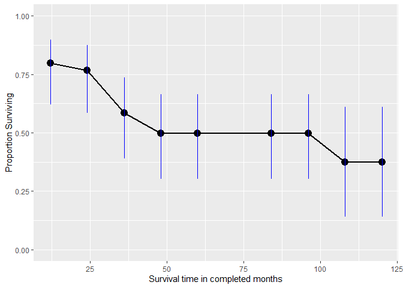<!-- -->

The Kaplan-Meier estimates of survival function can be provided by
`survfit()` from **survival** package. This function accepts as main
argument either a formula in the form of **Surv(time, event) \~ …**
(where `Surv()` comes also from **survival** package and is necessary as
in this way someone indicates that time to event as well as whether the
event has happened or not are modelled and on the right-hand side of the
formula we can use **“1”** for a single curve or a predictor for
comparing the curves for its values) or a previously fitted model
(e.g. a Cox model). Let’s see the overall survival in our sample.

``` r
overall_surv <- survfit(Surv(surv_mm, csr_fail) ~ 1, data = data1) %>% 
  summary(censored = TRUE)

lapply(c(2:7, 14:15), function(x) overall_surv[x]) %>%
  as.data.frame() %>%
  head(12) %>%
  kbl() %>%
  kable_styling()
```

<table class="table" style="margin-left: auto; margin-right: auto;">

<thead>

<tr>

<th style="text-align:right;">

time

</th>

<th style="text-align:right;">

n.risk

</th>

<th style="text-align:right;">

n.event

</th>

<th style="text-align:right;">

n.censor

</th>

<th style="text-align:right;">

surv

</th>

<th style="text-align:right;">

std.err

</th>

<th style="text-align:right;">

lower

</th>

<th style="text-align:right;">

upper

</th>

</tr>

</thead>

<tbody>

<tr>

<td style="text-align:right;">

2

</td>

<td style="text-align:right;">

35

</td>

<td style="text-align:right;">

1

</td>

<td style="text-align:right;">

1

</td>

<td style="text-align:right;">

0.9714286

</td>

<td style="text-align:right;">

0.0281603

</td>

<td style="text-align:right;">

0.9177740

</td>

<td style="text-align:right;">

1.0000000

</td>

</tr>

<tr>

<td style="text-align:right;">

3

</td>

<td style="text-align:right;">

33

</td>

<td style="text-align:right;">

1

</td>

<td style="text-align:right;">

0

</td>

<td style="text-align:right;">

0.9419913

</td>

<td style="text-align:right;">

0.0398241

</td>

<td style="text-align:right;">

0.8670838

</td>

<td style="text-align:right;">

1.0000000

</td>

</tr>

<tr>

<td style="text-align:right;">

5

</td>

<td style="text-align:right;">

32

</td>

<td style="text-align:right;">

1

</td>

<td style="text-align:right;">

0

</td>

<td style="text-align:right;">

0.9125541

</td>

<td style="text-align:right;">

0.0482479

</td>

<td style="text-align:right;">

0.8227247

</td>

<td style="text-align:right;">

1.0000000

</td>

</tr>

<tr>

<td style="text-align:right;">

7

</td>

<td style="text-align:right;">

31

</td>

<td style="text-align:right;">

1

</td>

<td style="text-align:right;">

0

</td>

<td style="text-align:right;">

0.8831169

</td>

<td style="text-align:right;">

0.0549426

</td>

<td style="text-align:right;">

0.7817379

</td>

<td style="text-align:right;">

0.9976432

</td>

</tr>

<tr>

<td style="text-align:right;">

8

</td>

<td style="text-align:right;">

30

</td>

<td style="text-align:right;">

1

</td>

<td style="text-align:right;">

0

</td>

<td style="text-align:right;">

0.8536797

</td>

<td style="text-align:right;">

0.0604853

</td>

<td style="text-align:right;">

0.7429939

</td>

<td style="text-align:right;">

0.9808546

</td>

</tr>

<tr>

<td style="text-align:right;">

9

</td>

<td style="text-align:right;">

29

</td>

<td style="text-align:right;">

1

</td>

<td style="text-align:right;">

0

</td>

<td style="text-align:right;">

0.8242424

</td>

<td style="text-align:right;">

0.0651704

</td>

<td style="text-align:right;">

0.7059160

</td>

<td style="text-align:right;">

0.9624029

</td>

</tr>

<tr>

<td style="text-align:right;">

11

</td>

<td style="text-align:right;">

28

</td>

<td style="text-align:right;">

1

</td>

<td style="text-align:right;">

0

</td>

<td style="text-align:right;">

0.7948052

</td>

<td style="text-align:right;">

0.0691725

</td>

<td style="text-align:right;">

0.6701624

</td>

<td style="text-align:right;">

0.9426302

</td>

</tr>

<tr>

<td style="text-align:right;">

13

</td>

<td style="text-align:right;">

27

</td>

<td style="text-align:right;">

0

</td>

<td style="text-align:right;">

1

</td>

<td style="text-align:right;">

0.7948052

</td>

<td style="text-align:right;">

0.0691725

</td>

<td style="text-align:right;">

0.6701624

</td>

<td style="text-align:right;">

0.9426302

</td>

</tr>

<tr>

<td style="text-align:right;">

14

</td>

<td style="text-align:right;">

26

</td>

<td style="text-align:right;">

0

</td>

<td style="text-align:right;">

1

</td>

<td style="text-align:right;">

0.7948052

</td>

<td style="text-align:right;">

0.0691725

</td>

<td style="text-align:right;">

0.6701624

</td>

<td style="text-align:right;">

0.9426302

</td>

</tr>

<tr>

<td style="text-align:right;">

19

</td>

<td style="text-align:right;">

25

</td>

<td style="text-align:right;">

0

</td>

<td style="text-align:right;">

1

</td>

<td style="text-align:right;">

0.7948052

</td>

<td style="text-align:right;">

0.0691725

</td>

<td style="text-align:right;">

0.6701624

</td>

<td style="text-align:right;">

0.9426302

</td>

</tr>

<tr>

<td style="text-align:right;">

22

</td>

<td style="text-align:right;">

24

</td>

<td style="text-align:right;">

1

</td>

<td style="text-align:right;">

0

</td>

<td style="text-align:right;">

0.7616883

</td>

<td style="text-align:right;">

0.0737932

</td>

<td style="text-align:right;">

0.6299586

</td>

<td style="text-align:right;">

0.9209639

</td>

</tr>

<tr>

<td style="text-align:right;">

25

</td>

<td style="text-align:right;">

23

</td>

<td style="text-align:right;">

0

</td>

<td style="text-align:right;">

1

</td>

<td style="text-align:right;">

0.7616883

</td>

<td style="text-align:right;">

0.0737932

</td>

<td style="text-align:right;">

0.6299586

</td>

<td style="text-align:right;">

0.9209639

</td>

</tr>

</tbody>

</table>

The use of `lapply()`, in this case, helps us extract the columns we
want to be displayed.

In order to graph the Kaplan-Meier estimates, we will use
`ggsurvplot()`, which accepts a *survfit* object, from **survminer**
package. Furthermore, we will specify some of its numerous available
arguments in order to improve the look of our graph.

``` r
ggsurvplot(fit = survfit(Surv(surv_mm, csr_fail) ~ 1, data = data1),
           title = "Kaplan-Meier estimates of cause-specific survival",
           xlab = "Months",
           ggtheme = theme_gray(),
           palette = "red",
           conf.int = TRUE,
           conf.int.fill = "black",
           surv.median.line = "hv",
           risk.table = TRUE,
           legend.title = "All patients")
```

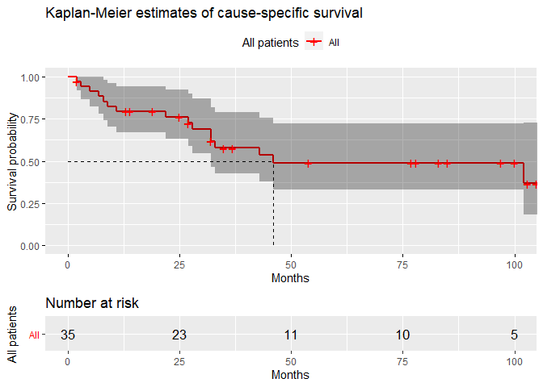<!-- -->

From now on, we will work with the *melanoma* dataset. We ’ll load it
and create factors for our categorical variables. We ’ll also create a
variable that takes the value 1 if the person has died from cancer and
the value 0 in every other case (dead due to other reason, alive or lost
to follow-up).

``` r
data2 <- read_dta("melanoma.dta")

data2$sex <- factor(data2$sex, labels = c("male", "female"))
data2$stage <- factor(data2$stage, labels = c("Unknown", "Localised", "Regional", "Distant"))
data2$subsite <- factor(data2$subsite, labels = c("Head and Neck", "Trunk", "Limbs", "Multiple and NOS"))

data2$year8594 <- factor(data2$year8594, labels = c("75-84", "85-94"))
data2$agegrp <- factor(data2$agegrp, labels = c("0-44", "45-59", "60-74", "75+"))

data2$event <- ifelse(data2$status == 1, 1, 0)
```

We’ll graph the survivor function using the Kaplan-Meier method,
separately for each of the two calendar periods in which diagnosis took
place, for only those patients with localised skin melanoma.

``` r
fit1 <- survfit(Surv(surv_mm, event) ~ year8594, data = data2, subset = (stage == "Localised"))

ggsurvplot(fit = fit1,
           title = "Kaplan-Meier survival estimates",
           subtitle = "Stratified by prognosis year",
           ggtheme = theme_gray(),
           xlab = "Months",
           palette = c("black", "yellow"),
           legend.title = "Patients with localised skin melanoma",
           legend.labs = c("year: 75-84", "year: 85-94"))
```

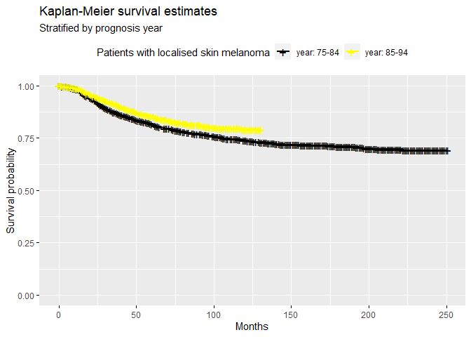<!-- -->

If we’d like to provide smoothed estimates for the hazard function,
there are some R packages developed for that purpose, which implement
different ways for semi- or non-parametric estimation of hazard
function. We will use `muhaz2()` from **biostat3** package, which is a
wrapper for `muhaz()` (**muhaz** package, uses kernel-based methods, see
documentation for a more extended description). The additional
possibility that `muhaz2()` does provide, in comparison with `muhaz()`,
is the stratified estimation of the hazard function. See
[https://arxiv.org/pdf/1509.03253.pdf](https://arxiv.org/pdf/1509.03253.pdf) for an extended
presentation of different ways of hazard rate estimation in R, by
Yolanda Hagar and Vanja Dukic. In the following lines of code, we’ll
estimate the hazard function for patients with localised skin melanoma,
for each of the two calendar periods in which diagnosis took place and
and afterwards we will create a plot of it.

``` r
muhaz2(formula(fit1), data = data2, subset = (stage == 'Localised')) %>%
  data.frame() %>%
  select("Time" = x, "Hazard" = y, "Strata" = year8594) %>%
  ggplot(aes(Time, Hazard)) + 
  geom_line(aes(color = Strata), size = 1.3) + 
  ggtitle("Smoothed hazard estimates by year of diagnosis")
```

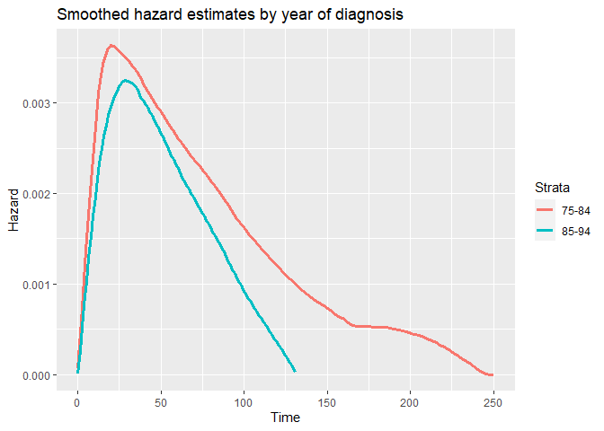<!-- -->

A log rank test to compare the survival of people with localised skin
melanoma between the two periods of diagnosis can be performed by
`survdiff()` function from **survival**. It accepts a formula, like
`survfit()`, and specifying the argument *rho* the type of test can be
controlled. By default, *rho* = 0, which is the usual log rank test
(Mantel-Haenszel), while *rho* = 1 leads to Peto & Peto modification of
Wilcoxon test (slightly different from the one in *Stata*)

``` r
survdiff(Surv(surv_mm, event) ~ year8594, data = data2, subset = (stage == "Localised"))
```

    ## Call:
    ## survdiff(formula = Surv(surv_mm, event) ~ year8594, data = data2, 
    ##     subset = (stage == "Localised"))
    ## 
    ##                   N Observed Expected (O-E)^2/E (O-E)^2/V
    ## year8594=75-84 2145      572      512      7.03      15.5
    ## year8594=85-94 3173      441      501      7.18      15.5
    ## 
    ##  Chisq= 15.5  on 1 degrees of freedom, p= 8e-05

``` r
survdiff(Surv(surv_mm, event) ~ year8594, data = data2, subset = (stage == "Localised"), rho = 1)
```

    ## Call:
    ## survdiff(formula = Surv(surv_mm, event) ~ year8594, data = data2, 
    ##     subset = (stage == "Localised"), rho = 1)
    ## 
    ##                   N Observed Expected (O-E)^2/E (O-E)^2/V
    ## year8594=75-84 2145      502      447      6.82      16.2
    ## year8594=85-94 3173      400      455      6.70      16.2
    ## 
    ##  Chisq= 16.2  on 1 degrees of freedom, p= 6e-05

Now, we will work with the whole of our sample, i.e all stages of cancer
metastasis. First, we will plot estimates of survivor and hazard
function by stage of metastasis.

``` r
fit2 <- survfit(Surv(surv_mm, event) ~ stage, data = data2)

ggsurvplot(fit = fit2,
           title = "Kaplan-Meier survival estimates",
           subtitle = "Stratified by metastasis stage",
           ggtheme = theme_gray(),
           xlab = "Months",
           palette = c("red", "green", "blue", "orange"),
           legend.labs = c("Unknown", "Localised", "Regional", "Distant"))
```

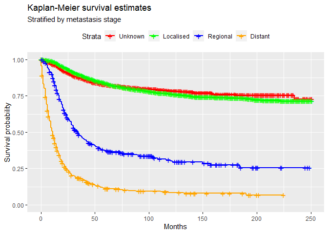<!-- -->

``` r
muhaz2(Surv(surv_mm, event) ~ stage, data = data2) %>%
  data.frame() %>%
  select("Time" = x, "Hazard" = y, "Strata" = stage) %>%
  ggplot(aes(Time, Hazard)) + 
  geom_line(aes(color = Strata), size = 1.3) + 
  ggtitle("Smoothed hazard estimates by stage of metastasis")
```

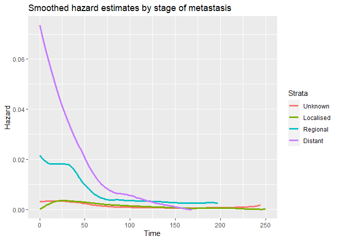<!-- -->

Estimation of the mortality rates for each stage:

``` r
data2 %>%
  group_by(stage) %>%
  summarise(D = sum(event == 1), 
            Y = sum(surv_mm),
            Rate = D / Y,
            Lower = Rate / exp(qnorm(0.025, lower.tail = FALSE) * sqrt(1 / D)),
            Upper = Rate * exp(qnorm(0.025, lower.tail = FALSE) * sqrt(1 / D))) %>%
  kbl(digits = 4) %>%
  kable_styling()
```

<table class="table" style="margin-left: auto; margin-right: auto;">

<thead>

<tr>

<th style="text-align:left;">

stage

</th>

<th style="text-align:right;">

D

</th>

<th style="text-align:right;">

Y

</th>

<th style="text-align:right;">

Rate

</th>

<th style="text-align:right;">

Lower

</th>

<th style="text-align:right;">

Upper

</th>

</tr>

</thead>

<tbody>

<tr>

<td style="text-align:left;">

Unknown

</td>

<td style="text-align:right;">

274

</td>

<td style="text-align:right;">

122390.04

</td>

<td style="text-align:right;">

0.0022

</td>

<td style="text-align:right;">

0.0020

</td>

<td style="text-align:right;">

0.0025

</td>

</tr>

<tr>

<td style="text-align:left;">

Localised

</td>

<td style="text-align:right;">

1013

</td>

<td style="text-align:right;">

460860.03

</td>

<td style="text-align:right;">

0.0022

</td>

<td style="text-align:right;">

0.0021

</td>

<td style="text-align:right;">

0.0023

</td>

</tr>

<tr>

<td style="text-align:left;">

Regional

</td>

<td style="text-align:right;">

218

</td>

<td style="text-align:right;">

17828.00

</td>

<td style="text-align:right;">

0.0122

</td>

<td style="text-align:right;">

0.0107

</td>

<td style="text-align:right;">

0.0140

</td>

</tr>

<tr>

<td style="text-align:left;">

Distant

</td>

<td style="text-align:right;">

408

</td>

<td style="text-align:right;">

10271.22

</td>

<td style="text-align:right;">

0.0397

</td>

<td style="text-align:right;">

0.0360

</td>

<td style="text-align:right;">

0.0438

</td>

</tr>

</tbody>

</table>

To obtain the same estimates per 1000 years of follow-up, we will first
create a variable that shows the survival of people in years and
afterwards we will proceed with similar manipulations as before.

``` r
data2 <- data2 %>%
  mutate(new_surv_mm = surv_mm/12)

data2 %>%
  group_by(stage) %>%
  summarise(D = sum(event == 1), 
            Y = sum(new_surv_mm) / 1000,
            Rate = D / Y,
            Lower = Rate / exp(qnorm(0.025, lower.tail = FALSE) * sqrt(1 / D)),
            Upper = Rate * exp(qnorm(0.025, lower.tail = FALSE) * sqrt(1 / D))) %>%
  kbl(digits = 4) %>%
  kable_styling()
```

<table class="table" style="margin-left: auto; margin-right: auto;">

<thead>

<tr>

<th style="text-align:left;">

stage

</th>

<th style="text-align:right;">

D

</th>

<th style="text-align:right;">

Y

</th>

<th style="text-align:right;">

Rate

</th>

<th style="text-align:right;">

Lower

</th>

<th style="text-align:right;">

Upper

</th>

</tr>

</thead>

<tbody>

<tr>

<td style="text-align:left;">

Unknown

</td>

<td style="text-align:right;">

274

</td>

<td style="text-align:right;">

10.1992

</td>

<td style="text-align:right;">

26.8649

</td>

<td style="text-align:right;">

23.8651

</td>

<td style="text-align:right;">

30.2419

</td>

</tr>

<tr>

<td style="text-align:left;">

Localised

</td>

<td style="text-align:right;">

1013

</td>

<td style="text-align:right;">

38.4050

</td>

<td style="text-align:right;">

26.3768

</td>

<td style="text-align:right;">

24.8015

</td>

<td style="text-align:right;">

28.0521

</td>

</tr>

<tr>

<td style="text-align:left;">

Regional

</td>

<td style="text-align:right;">

218

</td>

<td style="text-align:right;">

1.4857

</td>

<td style="text-align:right;">

146.7355

</td>

<td style="text-align:right;">

128.4945

</td>

<td style="text-align:right;">

167.5659

</td>

</tr>

<tr>

<td style="text-align:left;">

Distant

</td>

<td style="text-align:right;">

408

</td>

<td style="text-align:right;">

0.8559

</td>

<td style="text-align:right;">

476.6717

</td>

<td style="text-align:right;">

432.5921

</td>

<td style="text-align:right;">

525.2428

</td>

</tr>

</tbody>

</table>

Next, we will investigate whether survival is different for males and
females by plotting the survivor function, tabulating mortality rates
and conducting a log rank test.

``` r
fit3 <- survfit(Surv(new_surv_mm, event) ~ sex, data = data2)

ggsurvplot(fit = fit3,
           title = "Kaplan-Meier survival estimates",
           subtitle = "Stratified by metastasis stage",
           ggtheme = theme_gray(),
           xlab = "Years",
           palette = c("red", "blue"),
           legend.labs = c("Male", "Female"))
```

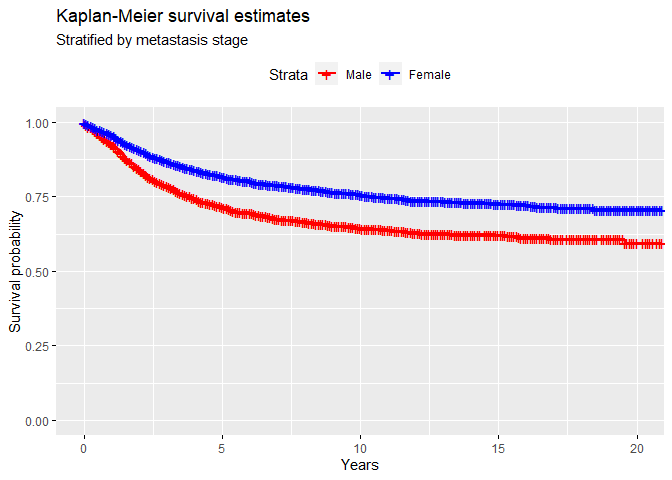<!-- -->

``` r
data2 %>%
  group_by(sex) %>%
  summarise(D = sum(event == 1), 
            Y = sum(new_surv_mm) / 1000,
            Rate = D / Y,
            Lower = Rate / exp(qnorm(0.025, lower.tail = FALSE) * sqrt(1 / D)),
            Upper = Rate * exp(qnorm(0.025, lower.tail = FALSE) * sqrt(1 / D))) %>%
  kbl(digits = 4) %>%
  kable_styling()
```

<table class="table" style="margin-left: auto; margin-right: auto;">

<thead>

<tr>

<th style="text-align:left;">

sex

</th>

<th style="text-align:right;">

D

</th>

<th style="text-align:right;">

Y

</th>

<th style="text-align:right;">

Rate

</th>

<th style="text-align:right;">

Lower

</th>

<th style="text-align:right;">

Upper

</th>

</tr>

</thead>

<tbody>

<tr>

<td style="text-align:left;">

male

</td>

<td style="text-align:right;">

1074

</td>

<td style="text-align:right;">

21.8156

</td>

<td style="text-align:right;">

49.2308

</td>

<td style="text-align:right;">

46.3728

</td>

<td style="text-align:right;">

52.2650

</td>

</tr>

<tr>

<td style="text-align:left;">

female

</td>

<td style="text-align:right;">

839

</td>

<td style="text-align:right;">

29.1302

</td>

<td style="text-align:right;">

28.8017

</td>

<td style="text-align:right;">

26.9173

</td>

<td style="text-align:right;">

30.8181

</td>

</tr>

</tbody>

</table>

``` r
survdiff(Surv(new_surv_mm, event) ~ sex, data = data2)
```

    ## Call:
    ## survdiff(formula = Surv(new_surv_mm, event) ~ sex, data = data2)
    ## 
    ##               N Observed Expected (O-E)^2/E (O-E)^2/V
    ## sex=male   3680     1074      852      57.6       105
    ## sex=female 4095      839     1061      46.3       105
    ## 
    ##  Chisq= 104  on 1 degrees of freedom, p= <2e-16

Finally, we will test whether survival probabilities differ
significantly by gender allowing for the effect of stage. Hence, we ’ll
perform a stratified log rank test. A stratified log rank test can be
implemented in R through `logrank_test()` from **coin** package. It
accepts a *formula* in the form of **Surv(time, event) \~ x|z**, where z
is an optional *factor* for stratification. Furthermore, we’ll plot the
survival function of males and females for all stages of cancer
metastasis. Note the use of `group_map()` from **purrr** (belongs to
**Tidyverse** family), that applies a function to each group of a
grouped object (here it applies `survfit()` separately to all the
observations in each stage of metastasis).

``` r
logrank_test(Surv(new_surv_mm, event) ~ sex | stage, data = data2)
```

    ## 
    ##  Asymptotic Two-Sample Logrank Test
    ## 
    ## data:  Surv(new_surv_mm, event) by
    ##   sex (male, female) 
    ##   stratified by stage
    ## Z = -7.0401, p-value = 1.921e-12
    ## alternative hypothesis: true theta is not equal to 1

``` r
strat_fit <- data2 %>% 
  group_by(stage) %>%
  group_map(~survfit(Surv(surv_mm, event) ~ sex, data = .)) 

ggsurvplot(fit = strat_fit[[1]],
           data = data2,
           title = "Kaplan-Meier survival estimates, by sex",
           subtitle = "Stage: Unknown",
           ggtheme = theme_gray(),
           xlab = "Years",
           palette = c("red", "blue"),
           legend.labs = c("Male", "Female"))
```

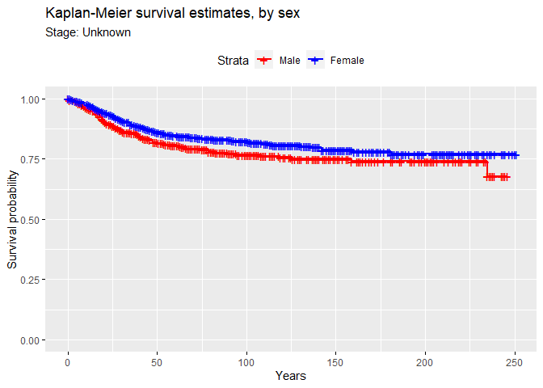<!-- -->

``` r
ggsurvplot(fit = strat_fit[[2]],
           data = data2,
           title = "Kaplan-Meier survival estimates, by sex",
           subtitle = "Stage: Localised",
           ggtheme = theme_gray(),
           xlab = "Years",
           palette = c("red", "blue"),
           legend.labs = c("Male", "Female"))
```

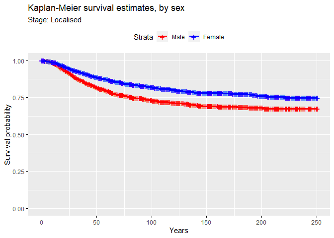<!-- -->

``` r
ggsurvplot(fit = strat_fit[[3]],
           data = data2,
           title = "Kaplan-Meier survival estimates, by sex",
           subtitle = "Stage: Regional",
           ggtheme = theme_gray(),
           xlab = "Years",
           palette = c("red", "blue"),
           legend.labs = c("Male", "Female"))
```

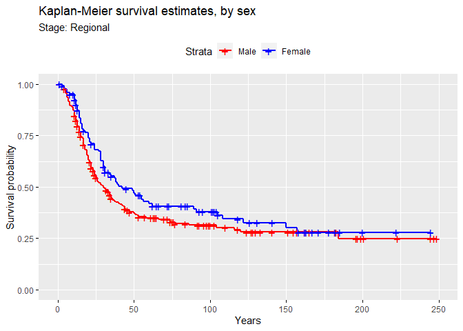<!-- -->

``` r
ggsurvplot(fit = strat_fit[[4]],
           data = data2,
           title = "Kaplan-Meier survival estimates, by sex",
           subtitle = "Stage: Distant",
           ggtheme = theme_gray(),
           xlab = "Years",
           palette = c("red", "blue"),
           legend.labs = c("Male", "Female"))
```

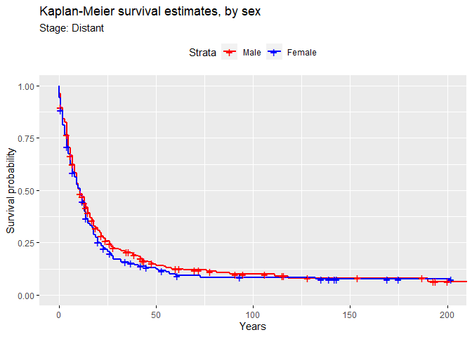<!-- -->

We are going to run a Cox PH model (not checking for PH though), using
as event the *Dead: cancer* category. The population of interest is the
patients with *Localised* cancer.

``` r
cox1 <- coxph(Surv(surv_mm, event) ~ year8594,
  data = data2,
  subset = (stage == 'Localised'),
  method = 'breslow') 

coef(summary(cox1)) %>%
  cbind(., exp(confint(cox1))) %>% 
  kbl(digits = 4) %>%
  kable_styling()
```

<table class="table" style="margin-left: auto; margin-right: auto;">

<thead>

<tr>

<th style="text-align:left;">

</th>

<th style="text-align:right;">

coef

</th>

<th style="text-align:right;">

exp(coef)

</th>

<th style="text-align:right;">

se(coef)

</th>

<th style="text-align:right;">

z

</th>

<th style="text-align:right;">

Pr(\>|z|)

</th>

<th style="text-align:right;">

2.5 %

</th>

<th style="text-align:right;">

97.5 %

</th>

</tr>

</thead>

<tbody>

<tr>

<td style="text-align:left;">

year859485-94

</td>

<td style="text-align:right;">

\-0.2575

</td>

<td style="text-align:right;">

0.773

</td>

<td style="text-align:right;">

0.0657

</td>

<td style="text-align:right;">

\-3.9217

</td>

<td style="text-align:right;">

1e-04

</td>

<td style="text-align:right;">

0.6797

</td>

<td style="text-align:right;">

0.8792

</td>

</tr>

</tbody>

</table>

From the table above, we can conclude that mortality cancer rates due to
melanoma during 1985-1994 have decreased 23%, compared to the earliest
period. Even though this estimate is not adjusted for any potential
confounder, it is highly statistically significant \[95% CI: (0.68,
0.88)\].

``` r
table1 <- cox1 %>% 
  summary() %>% 
  .[c(9, 10, 12)] %>% 
  unlist() %>% 
  round(4) %>% 
  as.data.frame()

colnames(table1) <- 'value'

table1 %>%  
  kbl(digits = 2) %>%
  kable_styling() 
```

<table class="table" style="margin-left: auto; margin-right: auto;">

<thead>

<tr>

<th style="text-align:left;">

</th>

<th style="text-align:right;">

value

</th>

</tr>

</thead>

<tbody>

<tr>

<td style="text-align:left;">

logtest.test

</td>

<td style="text-align:right;">

15.44

</td>

</tr>

<tr>

<td style="text-align:left;">

logtest.df

</td>

<td style="text-align:right;">

1.00

</td>

</tr>

<tr>

<td style="text-align:left;">

logtest.pvalue

</td>

<td style="text-align:right;">

0.00

</td>

</tr>

<tr>

<td style="text-align:left;">

sctest.test

</td>

<td style="text-align:right;">

15.46

</td>

</tr>

<tr>

<td style="text-align:left;">

sctest.df

</td>

<td style="text-align:right;">

1.00

</td>

</tr>

<tr>

<td style="text-align:left;">

sctest.pvalue

</td>

<td style="text-align:right;">

0.00

</td>

</tr>

<tr>

<td style="text-align:left;">

waldtest.test

</td>

<td style="text-align:right;">

15.38

</td>

</tr>

<tr>

<td style="text-align:left;">

waldtest.df

</td>

<td style="text-align:right;">

1.00

</td>

</tr>

<tr>

<td style="text-align:left;">

waldtest.pvalue

</td>

<td style="text-align:right;">

0.00

</td>

</tr>

</tbody>

</table>

The three test statistics are very similar, as we expected since all
assume the same thing. That PH holds (survival is proportional over time
across the categories of calendar period)

``` r
cox2 <- coxph(Surv(surv_mm, event) ~ sex + year8594 + agegrp,
  data = data2, 
  subset = (stage == 'Localised'),
  method = 'breslow')

coef(summary(cox2)) %>%
  cbind(., exp(confint(cox2))) %>% 
  kbl(digits = 4) %>%
  kable_styling()
```

<table class="table" style="margin-left: auto; margin-right: auto;">

<thead>

<tr>

<th style="text-align:left;">

</th>

<th style="text-align:right;">

coef

</th>

<th style="text-align:right;">

exp(coef)

</th>

<th style="text-align:right;">

se(coef)

</th>

<th style="text-align:right;">

z

</th>

<th style="text-align:right;">

Pr(\>|z|)

</th>

<th style="text-align:right;">

2.5 %

</th>

<th style="text-align:right;">

97.5 %

</th>

</tr>

</thead>

<tbody>

<tr>

<td style="text-align:left;">

sexfemale

</td>

<td style="text-align:right;">

\-0.5008

</td>

<td style="text-align:right;">

0.6061

</td>

<td style="text-align:right;">

0.0636

</td>

<td style="text-align:right;">

\-7.8726

</td>

<td style="text-align:right;">

0.000

</td>

<td style="text-align:right;">

0.5350

</td>

<td style="text-align:right;">

0.6865

</td>

</tr>

<tr>

<td style="text-align:left;">

year859485-94

</td>

<td style="text-align:right;">

\-0.3349

</td>

<td style="text-align:right;">

0.7154

</td>

<td style="text-align:right;">

0.0660

</td>

<td style="text-align:right;">

\-5.0714

</td>

<td style="text-align:right;">

0.000

</td>

<td style="text-align:right;">

0.6286

</td>

<td style="text-align:right;">

0.8143

</td>

</tr>

<tr>

<td style="text-align:left;">

agegrp45-59

</td>

<td style="text-align:right;">

0.2601

</td>

<td style="text-align:right;">

1.2970

</td>

<td style="text-align:right;">

0.0905

</td>

<td style="text-align:right;">

2.8745

</td>

<td style="text-align:right;">

0.004

</td>

<td style="text-align:right;">

1.0863

</td>

<td style="text-align:right;">

1.5487

</td>

</tr>

<tr>

<td style="text-align:left;">

agegrp60-74

</td>

<td style="text-align:right;">

0.6045

</td>

<td style="text-align:right;">

1.8303

</td>

<td style="text-align:right;">

0.0875

</td>

<td style="text-align:right;">

6.9084

</td>

<td style="text-align:right;">

0.000

</td>

<td style="text-align:right;">

1.5419

</td>

<td style="text-align:right;">

2.1727

</td>

</tr>

<tr>

<td style="text-align:left;">

agegrp75+

</td>

<td style="text-align:right;">

1.1886

</td>

<td style="text-align:right;">

3.2826

</td>

<td style="text-align:right;">

0.1024

</td>

<td style="text-align:right;">

11.6097

</td>

<td style="text-align:right;">

0.000

</td>

<td style="text-align:right;">

2.6858

</td>

<td style="text-align:right;">

4.0120

</td>

</tr>

</tbody>

</table>

For patients of the same sex diagnosed in the same calendar period,
those aged 60-74 have 83% higher risk of death due to melanoma than
those aged 0-44. This difference is statistically significant \[95% CI:
(1.54, 2.17)\].

We are going to investigate the importance of age as group in the model.
We are going to use likelihood ratio test. So, we will need the model
without age.

``` r
cox2noage <- update(cox2, .~. -agegrp)

lmtest::lrtest(cox2, cox2noage) %>%
  kbl(digits = 3) %>%
  kable_styling()
```

<table class="table" style="margin-left: auto; margin-right: auto;">

<thead>

<tr>

<th style="text-align:right;">

\#Df

</th>

<th style="text-align:right;">

LogLik

</th>

<th style="text-align:right;">

Df

</th>

<th style="text-align:right;">

Chisq

</th>

<th style="text-align:right;">

Pr(\>Chisq)

</th>

</tr>

</thead>

<tbody>

<tr>

<td style="text-align:right;">

5

</td>

<td style="text-align:right;">

\-8158.363

</td>

<td style="text-align:right;">

NA

</td>

<td style="text-align:right;">

NA

</td>

<td style="text-align:right;">

NA

</td>

</tr>

<tr>

<td style="text-align:right;">

2

</td>

<td style="text-align:right;">

\-8229.613

</td>

<td style="text-align:right;">

\-3

</td>

<td style="text-align:right;">

142.499

</td>

<td style="text-align:right;">

0

</td>

</tr>

</tbody>

</table>

As we’ve seen from the Wald test, the age variable, grouped as
categorical with 4 levels is highly significant in the model. LR test is
confirming this fact.

``` r
# instead of using the default "cloglog" of R, we create the function below
minusloglog <- function(x) {
  return(-log(-log(x)))
}

# Cox model to graph.
# We want to test proportionality so we are going to use log-log graph
# we also use log for the time 
cox1graph <- coxph(Surv(log(surv_mm ), event) ~ strata(year8594),
  data = data2,
  subset = (stage == 'Localised'),
  method = 'breslow')

ggsurvplot(survfit(cox1graph),
  data = data2,
  censor = FALSE,
  fun = minusloglog,
  )$plot +
  scale_x_continuous() +
  labs(x = 'ln(time)', y = '-ln(-ln(S(t)))',
       title = 'Log-log graph for assesing PH assumption',
       subtitle = 'Stratified by diagnosis period')
```

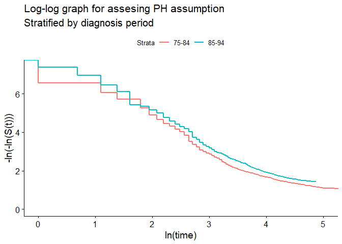<!-- -->

``` r
# smoothed hazard estimates, by year8594
muhaz2(formula(cox1), data = data2, subset = (stage == 'Localised')) %>%
  data.frame() %>%
  select("Time" = x, "Hazard" = y, "Strata" = year8594) %>%
  ggplot(aes(Time, Hazard)) + 
  geom_line(aes(color = Strata), size = 1.3) + 
  ggtitle("Smoothed hazard estimates by year of diagnosis")
```

<!-- -->

From the log-log graph we can see that patients diagnosed during 1985-94
have superior survival. The difference between the two curves is similar
over time, except one point where the curves cross. No reason to reject
proportionality assumption.

Up to  = 2"), we can see from the graph that we do not have much data
to rely on. Also we can check from our data, that only seven points are
take part in the graphs, up to  = 2") or  = 7.4").

``` r
survfit(cox1) %>%
  summary() %>%
  .[c('time', 'n.event')] %>%
  as.data.frame() %>%
  filter(between(log(time), 0, 2))
```

    ##   time n.event
    ## 1    1       5
    ## 2    2       1
    ## 3    3       4
    ## 4    4       4
    ## 5    5       7
    ## 6    6       5
    ## 7    7       8

From our model *cox1* we can conclude that . This is the proportionality constant
between the two groups.

Now, we are going to build a model with *years8594*, *age* and *sex* as
predictors.

``` r
cox3 <- coxph(Surv(log(surv_mm), event) ~ sex + year8594 + strata(agegrp),
  data = data2,
  method = 'breslow',
  subset = (stage == 'Localised'))

# test of PH assumption
cox.zph(cox2, 'identity')
```

    ##           chisq df       p
    ## sex       4.425  1 0.03541
    ## year8594  0.932  1 0.33447
    ## agegrp   15.329  3 0.00156
    ## GLOBAL   22.816  5 0.00037

``` r
# for this plot to present the graph for each strata, you need to assign strata(variable)
# in the cox model. Also assign log(time) instead of time.
ggsurvplot(survfit(cox3),
  data = data2,
  censor = FALSE,
  fun = minusloglog,
  )$plot +
  scale_x_continuous() +
  labs(x = 'ln(time)', y = '-ln(-ln(S(t)))',
       title = 'Log-log graph vs log(time) for assesing PH assumption',
       subtitle = 'Stratified by age group')
```

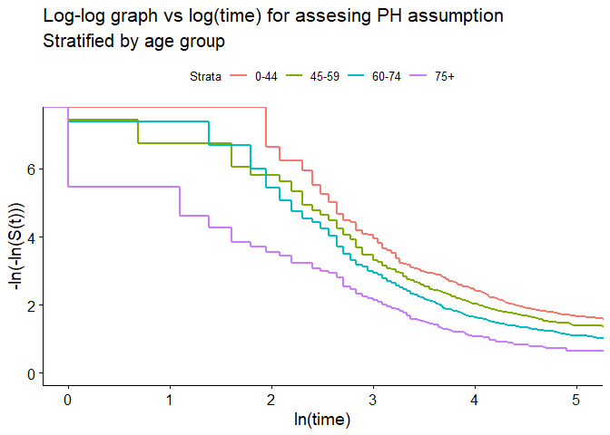<!-- -->

Here we present a second way of displaying smoothing hazard curves. We
will use the package `biostat3` and the function `coxphHaz()`.

``` r
cox4 <- coxph(Surv(surv_mm, event) ~ agegrp,
  data = data2,
  method = 'breslow',
  subset = (stage == 'Localised'))

muhaz2(formula(cox4), data = data2, subset = (stage == 'Localised')) %>%
  data.frame() %>%
  select("Time" = x, "Hazard" = y, "Strata" = agegrp) %>%
  ggplot(aes(Time, Hazard)) + 
  geom_line(aes(color = Strata)) + 
  ggtitle("Smoothed hazard estimates by age group")
```

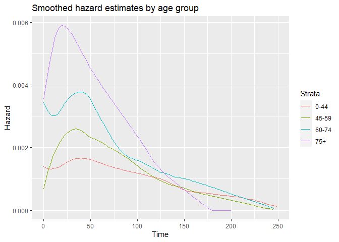<!-- -->

``` r
coxphHaz(cox4, newdata = data.frame(agegrp=levels(data2$agegrp))) %>%
  plot()
```

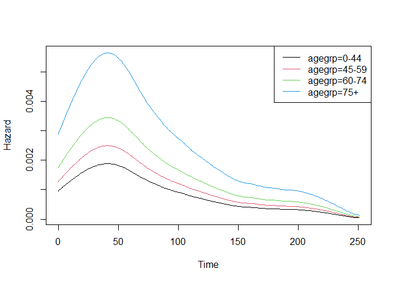<!-- -->

Next, we are going to plot the scaled Schoenfeld residuals. The smooth
line on the graph is an estimate of hazard ratio over time. We can see
that it diverges from a straight line and that’s a sign of
non-proportionality, regarding the age group variable.

``` r
ggcoxzph(cox.zph(cox4))
```

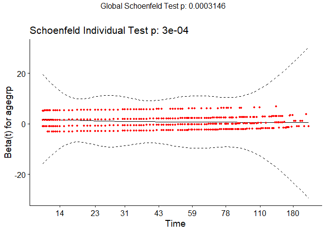<!-- -->

We also can use the extended Cox model for assesing time-varying
covariates. The extended Cox model uses an interaction between the
variable of interest with time. Below we present the way of producing
such model. We create inside the function `coxph()` another function
`tt()`. With this we can specify how the variable of interest, here
*agegrp*, will interact with time. As you’ve seen in the lab, we create
an indicator function of time.

  
 = \\left\\{
\\begin{array}{ll}
      1 & t\\geq 24 \\\\
      0 & t \< 24\\\\
\\end{array} 
\\right. 
")  

``` r
m <- coxph(Surv(surv_mm, event) ~ sex + year8594 + agegrp + tt(agegrp), 
           data = data2,
           subset = (stage == 'Localised'),
           method = "breslow",
           tt = function(x, t,...){
             mtrx <- model.matrix(~ x)[,-1] 
             mtrx*ifelse(t >= 24, 1, 0)
             })
           
cbind(coef(summary(m)), exp(confint(m))) %>%
  kbl(digits = 4) %>%
  kable_styling()
```

<table class="table" style="margin-left: auto; margin-right: auto;">

<thead>

<tr>

<th style="text-align:left;">

</th>

<th style="text-align:right;">

coef

</th>

<th style="text-align:right;">

exp(coef)

</th>

<th style="text-align:right;">

se(coef)

</th>

<th style="text-align:right;">

z

</th>

<th style="text-align:right;">

Pr(\>|z|)

</th>

<th style="text-align:right;">

2.5 %

</th>

<th style="text-align:right;">

97.5 %

</th>

</tr>

</thead>

<tbody>

<tr>

<td style="text-align:left;">

sexfemale

</td>

<td style="text-align:right;">

\-0.4974

</td>

<td style="text-align:right;">

0.6081

</td>

<td style="text-align:right;">

0.0636

</td>

<td style="text-align:right;">

\-7.8220

</td>

<td style="text-align:right;">

0.0000

</td>

<td style="text-align:right;">

0.5369

</td>

<td style="text-align:right;">

0.6888

</td>

</tr>

<tr>

<td style="text-align:left;">

year859485-94

</td>

<td style="text-align:right;">

\-0.3373

</td>

<td style="text-align:right;">

0.7137

</td>

<td style="text-align:right;">

0.0661

</td>

<td style="text-align:right;">

\-5.1038

</td>

<td style="text-align:right;">

0.0000

</td>

<td style="text-align:right;">

0.6270

</td>

<td style="text-align:right;">

0.8124

</td>

</tr>

<tr>

<td style="text-align:left;">

agegrp45-59

</td>

<td style="text-align:right;">

0.5324

</td>

<td style="text-align:right;">

1.7029

</td>

<td style="text-align:right;">

0.1963

</td>

<td style="text-align:right;">

2.7115

</td>

<td style="text-align:right;">

0.0067

</td>

<td style="text-align:right;">

1.1590

</td>

<td style="text-align:right;">

2.5022

</td>

</tr>

<tr>

<td style="text-align:left;">

agegrp60-74

</td>

<td style="text-align:right;">

0.9006

</td>

<td style="text-align:right;">

2.4610

</td>

<td style="text-align:right;">

0.1874

</td>

<td style="text-align:right;">

4.8055

</td>

<td style="text-align:right;">

0.0000

</td>

<td style="text-align:right;">

1.7045

</td>

<td style="text-align:right;">

3.5533

</td>

</tr>

<tr>

<td style="text-align:left;">

agegrp75+

</td>

<td style="text-align:right;">

1.6846

</td>

<td style="text-align:right;">

5.3902

</td>

<td style="text-align:right;">

0.1917

</td>

<td style="text-align:right;">

8.7856

</td>

<td style="text-align:right;">

0.0000

</td>

<td style="text-align:right;">

3.7016

</td>

<td style="text-align:right;">

7.8490

</td>

</tr>

<tr>

<td style="text-align:left;">

tt(agegrp)x45-59

</td>

<td style="text-align:right;">

\-0.3450

</td>

<td style="text-align:right;">

0.7082

</td>

<td style="text-align:right;">

0.2213

</td>

<td style="text-align:right;">

\-1.5590

</td>

<td style="text-align:right;">

0.1190

</td>

<td style="text-align:right;">

0.4590

</td>

<td style="text-align:right;">

1.0928

</td>

</tr>

<tr>

<td style="text-align:left;">

tt(agegrp)x60-74

</td>

<td style="text-align:right;">

\-0.3786

</td>

<td style="text-align:right;">

0.6848

</td>

<td style="text-align:right;">

0.2123

</td>

<td style="text-align:right;">

\-1.7834

</td>

<td style="text-align:right;">

0.0745

</td>

<td style="text-align:right;">

0.4517

</td>

<td style="text-align:right;">

1.0382

</td>

</tr>

<tr>

<td style="text-align:left;">

tt(agegrp)x75+

</td>

<td style="text-align:right;">

\-0.7336

</td>

<td style="text-align:right;">

0.4802

</td>

<td style="text-align:right;">

0.2305

</td>

<td style="text-align:right;">

\-3.1820

</td>

<td style="text-align:right;">

0.0015

</td>

<td style="text-align:right;">

0.3056

</td>

<td style="text-align:right;">

0.7545

</td>

</tr>

</tbody>

</table>

Now, we are going to include status **Dead: other** in our model, so we
can see how are estimates changing.

``` r
coxph(Surv(surv_mm, status == 1 | status == 2) ~ sex + year8594 + agegrp,
  data = data2,
  subset = (stage == 'Localised'),
  method = 'breslow')
```

    ## Call:
    ## coxph(formula = Surv(surv_mm, status == 1 | status == 2) ~ sex + 
    ##     year8594 + agegrp, data = data2, subset = (stage == "Localised"), 
    ##     method = "breslow")
    ## 
    ##                   coef exp(coef) se(coef)      z        p
    ## sexfemale     -0.46980   0.62513  0.04781 -9.827  < 2e-16
    ## year859485-94 -0.28902   0.74899  0.05167 -5.593 2.23e-08
    ## agegrp45-59    0.47189   1.60302  0.08140  5.797 6.74e-09
    ## agegrp60-74    1.22401   3.40080  0.07481 16.362  < 2e-16
    ## agegrp75+      2.25288   9.51506  0.07960 28.301  < 2e-16
    ## 
    ## Likelihood ratio test=1052  on 5 df, p=< 2.2e-16
    ## n= 5318, number of events= 1795

For patients of the same sex, those aged 60-74 at diagnosis have 3.4
times higher risk of death due to any cause than those aged 0-44. This
difference is statistically significant.

Compared to the previous model in which we assumed that cancer death was
the event/failure, here we assume that event is death by any cause. The
estimated hazard ratios for sex and period are similar, but when it
comes to the age specific estimates, the results are very different.
This is due to the fact that all-cause mortality is increasing as age
increases.

Next, we are going to use the full dataset and not just the population
with localised cancer for the models below.

``` r
coxph(Surv(surv_mm, status == 1) ~ sex,
  data = data2,
  method = 'breslow')
```

    ## Call:
    ## coxph(formula = Surv(surv_mm, status == 1) ~ sex, data = data2, 
    ##     method = "breslow")
    ## 
    ##               coef exp(coef) se(coef)      z      p
    ## sexfemale -0.46632   0.62731  0.04612 -10.11 <2e-16
    ## 
    ## Likelihood ratio test=103.2  on 1 df, p=< 2.2e-16
    ## n= 7775, number of events= 1913

We can see that without adjusting for potential confounders, females
have 38% lower mortality than males.

``` r
coxph(Surv(surv_mm, status == 1) ~ sex + year8594 + agegrp + subsite + stage,
  data = data2,
  method = 'breslow')
```

    ## Call:
    ## coxph(formula = Surv(surv_mm, status == 1) ~ sex + year8594 + 
    ##     agegrp + subsite + stage, data = data2, method = "breslow")
    ## 
    ##                             coef exp(coef) se(coef)      z        p
    ## sexfemale               -0.28893   0.74907  0.04865 -5.938 2.88e-09
    ## year859485-94           -0.23981   0.78677  0.04790 -5.006 5.55e-07
    ## agegrp45-59              0.23787   1.26854  0.06745  3.527 0.000421
    ## agegrp60-74              0.54856   1.73077  0.06510  8.426  < 2e-16
    ## agegrp75+                1.02455   2.78585  0.07640 13.411  < 2e-16
    ## subsiteTrunk             0.33157   1.39315  0.07064  4.694 2.69e-06
    ## subsiteLimbs             0.03152   1.03202  0.07435  0.424 0.671604
    ## subsiteMultiple and NOS  0.26645   1.30532  0.10232  2.604 0.009214
    ## stageLocalised           0.03761   1.03833  0.06869  0.548 0.584016
    ## stageRegional            1.56266   4.77152  0.09145 17.088  < 2e-16
    ## stageDistant             2.60170  13.48664  0.08141 31.959  < 2e-16
    ## 
    ## Likelihood ratio test=1836  on 11 df, p=< 2.2e-16
    ## n= 7775, number of events= 1913

After adjusting for potential confounders we see that the estimated
difference in cancer mortality between males and females had decreased
slightly but there is still quite large difference.
