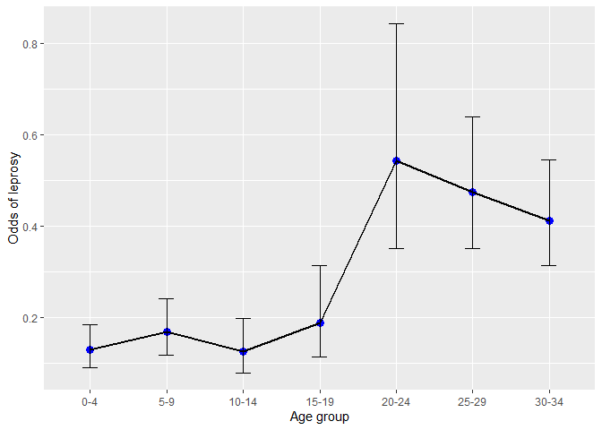
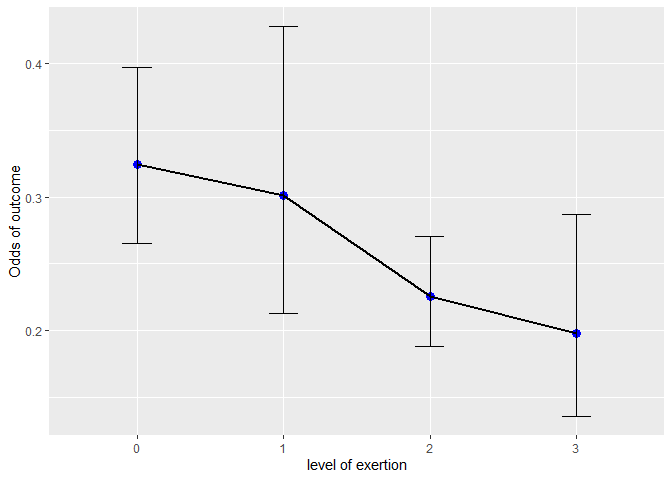

Statistical Methods in Epidemiology - Lab 6
================

## Table of Contents

1.  [Unmatched studies - individual records](#unmatched)
2.  [Age as a confounder in the BCG data](#age)
3.  [Logistic regression](#logistic)
4.  [Frequency records](#frequency)

# Unmatched Case - Control Studies

We’ll begin by loading the libraries that will be used throughout the
lab.

``` r
library(epiDisplay)
library(epiR)
library(gmodels)
library(haven)
library(kableExtra)
library(lmtest)
library(tidyverse)
```

## 1\. Unmatched studies - individual records <a name="unmatched"></a>

Initially, we will work with the *lep* dataset. It contains records for
274 cases of leprosy and 1096 controls (variable *d*, coded 1 for cases
and 0 for controls). The rest of the variables are BCG scar (present or
absent), age at the time when the case or control was registered, sex,
type of house and education of mother. We’ll create factors for the
categorical variables. Here, age is a categorical variable, but we will
keep the continuous version and create a categorical one, as we’ll use
both of them in what follows.

``` r
data1 <- read_dta("lep.dta")

data1$d <- factor(data1$d, levels = c("1", "0"), labels = c("Cases", "Controls"))
data1$sex <- factor(data1$sex, labels = c("Male", "Female"))
data1$bcg <- factor(data1$bcg, levels = c("1", "0"), labels = c("Present", "Absent"))

data1$cage <- factor(data1$age, labels = c("0-4", "5-9", "10-14", "15-19", "20-24", "25-29", "30-34"))
```

The distribution of *BCG* within cases and controls can be obtained in
the following way.

``` r
with(data1, CrossTable(bcg, d, prop.r = FALSE, prop.t = FALSE, prop.chisq = FALSE))
```

    ## 
    ##  
    ##    Cell Contents
    ## |-------------------------|
    ## |                       N |
    ## |           N / Col Total |
    ## |-------------------------|
    ## 
    ##  
    ## Total Observations in Table:  1370 
    ## 
    ##  
    ##              | d 
    ##          bcg |     Cases |  Controls | Row Total | 
    ## -------------|-----------|-----------|-----------|
    ##      Present |        47 |       500 |       547 | 
    ##              |     0.172 |     0.456 |           | 
    ## -------------|-----------|-----------|-----------|
    ##       Absent |       227 |       596 |       823 | 
    ##              |     0.828 |     0.544 |           | 
    ## -------------|-----------|-----------|-----------|
    ## Column Total |       274 |      1096 |      1370 | 
    ##              |     0.200 |     0.800 |           | 
    ## -------------|-----------|-----------|-----------|
    ## 
    ## 

To obtain a table of mean age by case - control status, we can work with
tools from **Tidyverse**. Note that, in this case, age is treated as a
continuous variable.

``` r
data1 %>%
  group_by(d) %>%
  summarise(Mean_Age = mean(age), 
            Std_Dev = sd(age), 
            Freq = n()) %>%
  kbl(digits = 2) %>%
  kable_styling()
```

<table class="table" style="margin-left: auto; margin-right: auto;">

<thead>

<tr>

<th style="text-align:left;">

d

</th>

<th style="text-align:right;">

Mean\_Age

</th>

<th style="text-align:right;">

Std\_Dev

</th>

<th style="text-align:right;">

Freq

</th>

</tr>

</thead>

<tbody>

<tr>

<td style="text-align:left;">

Cases

</td>

<td style="text-align:right;">

3.65

</td>

<td style="text-align:right;">

2.16

</td>

<td style="text-align:right;">

274

</td>

</tr>

<tr>

<td style="text-align:left;">

Controls

</td>

<td style="text-align:right;">

2.52

</td>

<td style="text-align:right;">

2.19

</td>

<td style="text-align:right;">

1096

</td>

</tr>

</tbody>

</table>

Next, we’d like to calculate the odds ratio of leprosy comparing people
with BCG present to those with BCG absent. We can work with `epi.2by2()`
from **epiR** package (we’ll also get further information, e.g. a test
of equality of odds). For a description of how this function works, see
**Lab 1** or documentation.

``` r
table1 <- with(data1, table(d, bcg))

epi.2by2(table1, method = "case.control", outcome = "as.rows")
```

    ##              Exposed +    Exposed -      Total
    ## Outcome +           47          227        274
    ## Outcome -          500          596       1096
    ## Total              547          823       1370
    ## 
    ## Point estimates and 95% CIs:
    ## -------------------------------------------------------------------
    ## Odds ratio (W)                               0.25 (0.18, 0.35)
    ## Attrib prevalence *                          -18.99 (-22.84, -15.14)
    ## Attrib prevalence in population *            -7.58 (-11.30, -3.87)
    ## Attrib fraction (est) in exposed  (%)        -304.81 (-479.42, -187.47)
    ## Attrib fraction (est) in population (%)      -52.35 (-64.45, -41.14)
    ## -------------------------------------------------------------------
    ##  Test that OR = 1: chi2(1) = 74.060 Pr>chi2 = <0.001
    ##  Wald confidence limits
    ##  CI: confidence interval
    ##  * Outcomes per 100 population units

Now, we’ll work with the categorical version of age. First, we will
manually calculate the odds of leprosy for every age category, along
with 95% confidence intervals.

``` r
odds <- data1 %>% 
  group_by(cage) %>%
  summarise(Cases = sum(d == "Cases"), 
            Controls = sum(d == "Controls")) %>%
  mutate(Odds = Cases / Controls, 
         ll = Odds / exp(qnorm(0.025, lower.tail = FALSE) * sqrt(1 / Cases + 1 / Controls)), 
         ul = Odds * exp(qnorm(0.025, lower.tail = FALSE) * sqrt(1 / Cases + 1 / Controls))) %>%
  select("Age" = cage, Cases, Controls, Odds, ll, ul) 


odds %>% 
  kbl(digits = 3) %>%
  kable_styling()
```

<table class="table" style="margin-left: auto; margin-right: auto;">

<thead>

<tr>

<th style="text-align:left;">

Age

</th>

<th style="text-align:right;">

Cases

</th>

<th style="text-align:right;">

Controls

</th>

<th style="text-align:right;">

Odds

</th>

<th style="text-align:right;">

ll

</th>

<th style="text-align:right;">

ul

</th>

</tr>

</thead>

<tbody>

<tr>

<td style="text-align:left;">

0-4

</td>

<td style="text-align:right;">

34

</td>

<td style="text-align:right;">

263

</td>

<td style="text-align:right;">

0.129

</td>

<td style="text-align:right;">

0.090

</td>

<td style="text-align:right;">

0.185

</td>

</tr>

<tr>

<td style="text-align:left;">

5-9

</td>

<td style="text-align:right;">

35

</td>

<td style="text-align:right;">

207

</td>

<td style="text-align:right;">

0.169

</td>

<td style="text-align:right;">

0.118

</td>

<td style="text-align:right;">

0.242

</td>

</tr>

<tr>

<td style="text-align:left;">

10-14

</td>

<td style="text-align:right;">

21

</td>

<td style="text-align:right;">

167

</td>

<td style="text-align:right;">

0.126

</td>

<td style="text-align:right;">

0.080

</td>

<td style="text-align:right;">

0.198

</td>

</tr>

<tr>

<td style="text-align:left;">

15-19

</td>

<td style="text-align:right;">

18

</td>

<td style="text-align:right;">

95

</td>

<td style="text-align:right;">

0.189

</td>

<td style="text-align:right;">

0.114

</td>

<td style="text-align:right;">

0.314

</td>

</tr>

<tr>

<td style="text-align:left;">

20-24

</td>

<td style="text-align:right;">

31

</td>

<td style="text-align:right;">

57

</td>

<td style="text-align:right;">

0.544

</td>

<td style="text-align:right;">

0.351

</td>

<td style="text-align:right;">

0.842

</td>

</tr>

<tr>

<td style="text-align:left;">

25-29

</td>

<td style="text-align:right;">

64

</td>

<td style="text-align:right;">

135

</td>

<td style="text-align:right;">

0.474

</td>

<td style="text-align:right;">

0.352

</td>

<td style="text-align:right;">

0.638

</td>

</tr>

<tr>

<td style="text-align:left;">

30-34

</td>

<td style="text-align:right;">

71

</td>

<td style="text-align:right;">

172

</td>

<td style="text-align:right;">

0.413

</td>

<td style="text-align:right;">

0.313

</td>

<td style="text-align:right;">

0.544

</td>

</tr>

</tbody>

</table>

Afterwards, we will provide the odds ratios of leprosy comparing every
age category to the reference age category (i.e. 0-4). That’s a bit more
challenging.

``` r
odds %>%
  mutate(OR = Odds / Odds[Age == "0-4"],
         LL = OR / exp(qnorm(0.025, lower.tail = FALSE) * sqrt(1 / Cases + 1 / Controls + 1 / Cases[Age == "0-4"] + 1 / Controls[Age == "0-4"])),
         UL = OR * exp(qnorm(0.025, lower.tail = FALSE) * sqrt(1 / Cases + 1 / Controls + 1 / Cases[Age == "0-4"] + 1 / Controls[Age == "0-4"])),
         ) %>%
  select(Age, OR, LL, UL) %>%
  filter(Age != "0-4") %>%
  kbl(digits = 3) %>%
  kable_styling()
```

<table class="table" style="margin-left: auto; margin-right: auto;">

<thead>

<tr>

<th style="text-align:left;">

Age

</th>

<th style="text-align:right;">

OR

</th>

<th style="text-align:right;">

LL

</th>

<th style="text-align:right;">

UL

</th>

</tr>

</thead>

<tbody>

<tr>

<td style="text-align:left;">

5-9

</td>

<td style="text-align:right;">

1.308

</td>

<td style="text-align:right;">

0.789

</td>

<td style="text-align:right;">

2.169

</td>

</tr>

<tr>

<td style="text-align:left;">

10-14

</td>

<td style="text-align:right;">

0.973

</td>

<td style="text-align:right;">

0.546

</td>

<td style="text-align:right;">

1.733

</td>

</tr>

<tr>

<td style="text-align:left;">

15-19

</td>

<td style="text-align:right;">

1.466

</td>

<td style="text-align:right;">

0.790

</td>

<td style="text-align:right;">

2.718

</td>

</tr>

<tr>

<td style="text-align:left;">

20-24

</td>

<td style="text-align:right;">

4.207

</td>

<td style="text-align:right;">

2.392

</td>

<td style="text-align:right;">

7.400

</td>

</tr>

<tr>

<td style="text-align:left;">

25-29

</td>

<td style="text-align:right;">

3.667

</td>

<td style="text-align:right;">

2.304

</td>

<td style="text-align:right;">

5.837

</td>

</tr>

<tr>

<td style="text-align:left;">

30-34

</td>

<td style="text-align:right;">

3.193

</td>

<td style="text-align:right;">

2.033

</td>

<td style="text-align:right;">

5.016

</td>

</tr>

</tbody>

</table>

A plot of the odds of leprosy against levels of age can be created in
the following way.

``` r
ggplot(odds, aes(Age, Odds)) + 
  geom_point(size = 3, colour = "blue") + 
  geom_line(group = 1, size = 1) +
  geom_errorbar(aes(ymin = ll, ymax = ul), width = 0.2, size = 0.2, color = "black") + 
  ylab("Odds of leprosy") +
  xlab("Age group")
```

<!-- -->

## II. Age as a confounder in the BCG data <a name='age'></a>

Now, we’d like to investigate whether age is a confounder in the BCG -
leprosy relationship. One way to test this, besides fitting a logistic
regression model adjusted for age, is to stratify by age and calculate
the Mantel - Haenszel estimate of odds ratio. A useful function for this
purpose is `mhor()` by **epiDisplay** package, that takes as main
argument a stratified table (there is also `mantelhaen.test()` from Base
R).

``` r
table2 <- with(data1, table(d, bcg, cage))

mhor(mhtable = table2, graph = FALSE)
```

    ## 
    ## Stratified analysis by  cage 
    ##                 OR lower lim. upper lim.  P value
    ## cage 0-4     0.438    0.18928      0.970 2.92e-02
    ## cage 5-9     0.578    0.25960      1.263 1.46e-01
    ## cage 10-14   0.279    0.09806      0.784 7.88e-03
    ## cage 15-19   0.134    0.02970      0.475 3.84e-04
    ## cage 20-24   0.389    0.10043      1.259 1.32e-01
    ## cage 25-29   0.164    0.00375      1.153 6.50e-02
    ## cage 30-34   0.000    0.00000      0.762 1.23e-02
    ## M-H combined 0.329    0.22514      0.482 4.06e-09
    ## 
    ## M-H Chi2(1) = 34.59 , P value = 0 
    ## 
    ##  One or more cells of the stratified table == 0. 
    ##  Homogeneity test not computable. 
    ## 

If we’d like to control for both age and sex, we have to keep in mind
that `mhor()` (as well as all R functions that i know that calculate
Mantel - Haenszel odds ratio) do not expicitly allow tables stratified
by more than one variable and the most easy way to proceed is fitting a
model. Despite that, if we insist on the former way, we have to create a
variable from all combinations of levels of age and sex and stratify by
it.

``` r
data <- data1 %>% 
  mutate(Age_Sex = factor(case_when(cage == "0-4" & sex == "Male" ~ "1a", 
                                    cage == "0-4" & sex == "Female" ~ "1b", 
                                    cage == "5-9" & sex == "Male" ~ "2a",
                                    cage == "5-9" & sex == "Female" ~ "2b",
                                    cage == "10-14" & sex == "Male" ~ "3a",
                                    cage == "10-14" & sex == "Female" ~ "3b",
                                    cage == "15-19" & sex == "Male" ~ "4a",
                                    cage == "15-19" & sex == "Female" ~ "4b",
                                    cage == "20-24" & sex == "Male" ~ "5a",
                                    cage == "20-24" & sex == "Female" ~ "5b",
                                    cage == "25-29" & sex == "Male" ~ "6a",
                                    cage == "25-29" & sex == "Female" ~ "6b",
                                    cage == "30-34" & sex == "Male" ~ "7a",
                                    cage == "30-34" & sex == "Female" ~ "7b"))) 

table3 <- with(data, table(d, bcg, Age_Sex))

mhor(mhtable = table3, graph = FALSE)
```

    ## 
    ## Stratified analysis by  Age_Sex 
    ##                 OR lower lim. upper lim.  P value
    ## Age_Sex 1a   0.328    0.08461      1.091 6.08e-02
    ## Age_Sex 1b   0.580    0.17812      1.764 3.21e-01
    ## Age_Sex 2a   0.523    0.17003      1.524 2.25e-01
    ## Age_Sex 2b   0.666    0.18980      2.281 5.80e-01
    ## Age_Sex 3a   0.235    0.04672      1.168 4.02e-02
    ## Age_Sex 3b   0.315    0.06934      1.361 8.30e-02
    ## Age_Sex 4a   0.392    0.00479     32.187 4.94e-01
    ## Age_Sex 4b   0.138    0.02176      0.613 3.21e-03
    ## Age_Sex 5a   0.792    0.12438      4.538 1.00e+00
    ## Age_Sex 5b   0.133    0.00286      1.057 4.22e-02
    ## Age_Sex 6a   0.499    0.01001      4.858 1.00e+00
    ## Age_Sex 6b   0.000    0.00000      1.245 9.47e-02
    ## Age_Sex 7a   0.000    0.00000      2.308 1.90e-01
    ## Age_Sex 7b   0.000    0.00000      1.471 9.69e-02
    ## M-H combined 0.337    0.22934      0.495 1.52e-08
    ## 
    ## M-H Chi2(1) = 32.02 , P value = 0 
    ## 
    ##  One or more cells of the stratified table == 0. 
    ##  Homogeneity test not computable. 
    ## 

## III. Logistic regression <a name='logistic'></a>

To proceed with logistic regression models, at first we need to relevel
variables *d* and *bcg*. We’ll accomplish it using `fct_relevel()` from
**forcats** (belongs to **Tidyverse** family). It provides numerous ways
to change the levels of a factor, but the most simple one is to write
the levels in the order you want them to be. If you specify only a
subset of the levels, the ones that are not specified will keep their
initial order, but will come after those that are specifed (in variable
*d* for example, specifying only *“Controls”* means that level
*“Controls”* will be first and after that all the rest of the levels
will be in their initial order, i.e the level *“Cases”* will be in the
second position as it’s the only level left)

``` r
data1$d <- fct_relevel(data1$d, "Controls")
data1$bcg <- fct_relevel(data1$bcg, "Absent")
```

So, in what follows, we will work with logistic regression models.
Inside the `glm()` function you need to specify **family = binomial**
and by default link function is *logit*. To obtain the odds ratios along
with their standard errors and 95% confidence intervals, we will use
`r_table()` function that we had created in **Lab3** (see **Lab3** for
the code).

Let’s find the effect of **BCG** through a logistic regression model.

``` r
fit1 <- glm(d ~ bcg, data = data1, family = binomial)

summary(fit1)
```

    ## 
    ## Call:
    ## glm(formula = d ~ bcg, family = binomial, data = data1)
    ## 
    ## Deviance Residuals: 
    ##     Min       1Q   Median       3Q      Max  
    ## -0.8034  -0.8034  -0.4239  -0.4239   2.2155  
    ## 
    ## Coefficients:
    ##             Estimate Std. Error z value Pr(>|z|)    
    ## (Intercept) -0.96529    0.07799 -12.376  < 2e-16 ***
    ## bcgPresent  -1.39917    0.17135  -8.166  3.2e-16 ***
    ## ---
    ## Signif. codes:  0 '***' 0.001 '**' 0.01 '*' 0.05 '.' 0.1 ' ' 1
    ## 
    ## (Dispersion parameter for binomial family taken to be 1)
    ## 
    ##     Null deviance: 1371.1  on 1369  degrees of freedom
    ## Residual deviance: 1290.0  on 1368  degrees of freedom
    ## AIC: 1294
    ## 
    ## Number of Fisher Scoring iterations: 5

To obtain the odds ratio of leprosy comparing people with BCG present to
those with BCG absent, we will use `r_table()`.

``` r
r_table(fit1) %>%
  kbl(digits = 3) %>%
  kable_styling()
```

<table class="table" style="margin-left: auto; margin-right: auto;">

<thead>

<tr>

<th style="text-align:left;">

Predictors

</th>

<th style="text-align:right;">

OR

</th>

<th style="text-align:right;">

Std\_Err

</th>

<th style="text-align:right;">

z\_value

</th>

<th style="text-align:left;">

P-Value

</th>

<th style="text-align:right;">

LL

</th>

<th style="text-align:right;">

UL

</th>

</tr>

</thead>

<tbody>

<tr>

<td style="text-align:left;">

bcgPresent

</td>

<td style="text-align:right;">

0.247

</td>

<td style="text-align:right;">

0.042

</td>

<td style="text-align:right;">

\-8.166

</td>

<td style="text-align:left;">

\<0.001

</td>

<td style="text-align:right;">

0.176

</td>

<td style="text-align:right;">

0.345

</td>

</tr>

</tbody>

</table>

Same for a model with age as independent variable.

``` r
fit2 <- glm(d ~ cage, data = data1, family = binomial)

r_table(fit2) %>%
  kbl(digits = 3) %>%
  kable_styling()
```

<table class="table" style="margin-left: auto; margin-right: auto;">

<thead>

<tr>

<th style="text-align:left;">

Predictors

</th>

<th style="text-align:right;">

OR

</th>

<th style="text-align:right;">

Std\_Err

</th>

<th style="text-align:right;">

z\_value

</th>

<th style="text-align:left;">

P-Value

</th>

<th style="text-align:right;">

LL

</th>

<th style="text-align:right;">

UL

</th>

</tr>

</thead>

<tbody>

<tr>

<td style="text-align:left;">

cage5-9

</td>

<td style="text-align:right;">

1.308

</td>

<td style="text-align:right;">

0.338

</td>

<td style="text-align:right;">

1.040

</td>

<td style="text-align:left;">

0.298

</td>

<td style="text-align:right;">

0.789

</td>

<td style="text-align:right;">

2.169

</td>

</tr>

<tr>

<td style="text-align:left;">

cage10-14

</td>

<td style="text-align:right;">

0.973

</td>

<td style="text-align:right;">

0.287

</td>

<td style="text-align:right;">

\-0.094

</td>

<td style="text-align:left;">

0.925

</td>

<td style="text-align:right;">

0.546

</td>

<td style="text-align:right;">

1.733

</td>

</tr>

<tr>

<td style="text-align:left;">

cage15-19

</td>

<td style="text-align:right;">

1.466

</td>

<td style="text-align:right;">

0.462

</td>

<td style="text-align:right;">

1.213

</td>

<td style="text-align:left;">

0.225

</td>

<td style="text-align:right;">

0.790

</td>

<td style="text-align:right;">

2.718

</td>

</tr>

<tr>

<td style="text-align:left;">

cage20-24

</td>

<td style="text-align:right;">

4.207

</td>

<td style="text-align:right;">

1.212

</td>

<td style="text-align:right;">

4.987

</td>

<td style="text-align:left;">

\<0.001

</td>

<td style="text-align:right;">

2.392

</td>

<td style="text-align:right;">

7.400

</td>

</tr>

<tr>

<td style="text-align:left;">

cage25-29

</td>

<td style="text-align:right;">

3.667

</td>

<td style="text-align:right;">

0.870

</td>

<td style="text-align:right;">

5.479

</td>

<td style="text-align:left;">

\<0.001

</td>

<td style="text-align:right;">

2.304

</td>

<td style="text-align:right;">

5.837

</td>

</tr>

<tr>

<td style="text-align:left;">

cage30-34

</td>

<td style="text-align:right;">

3.193

</td>

<td style="text-align:right;">

0.736

</td>

<td style="text-align:right;">

5.038

</td>

<td style="text-align:left;">

\<0.001

</td>

<td style="text-align:right;">

2.033

</td>

<td style="text-align:right;">

5.016

</td>

</tr>

</tbody>

</table>

To find the effect BCG controlled for age:

``` r
fit3 <- glm(d ~ bcg + cage, data = data1, family = binomial)

r_table(fit3) %>%
  kbl(digits = 3) %>%
  kable_styling()
```

<table class="table" style="margin-left: auto; margin-right: auto;">

<thead>

<tr>

<th style="text-align:left;">

Predictors

</th>

<th style="text-align:right;">

OR

</th>

<th style="text-align:right;">

Std\_Err

</th>

<th style="text-align:right;">

z\_value

</th>

<th style="text-align:left;">

P-Value

</th>

<th style="text-align:right;">

LL

</th>

<th style="text-align:right;">

UL

</th>

</tr>

</thead>

<tbody>

<tr>

<td style="text-align:left;">

bcgPresent

</td>

<td style="text-align:right;">

0.331

</td>

<td style="text-align:right;">

0.064

</td>

<td style="text-align:right;">

\-5.732

</td>

<td style="text-align:left;">

\<0.001

</td>

<td style="text-align:right;">

0.227

</td>

<td style="text-align:right;">

0.483

</td>

</tr>

<tr>

<td style="text-align:left;">

cage5-9

</td>

<td style="text-align:right;">

1.339

</td>

<td style="text-align:right;">

0.351

</td>

<td style="text-align:right;">

1.113

</td>

<td style="text-align:left;">

0.266

</td>

<td style="text-align:right;">

0.801

</td>

<td style="text-align:right;">

2.240

</td>

</tr>

<tr>

<td style="text-align:left;">

cage10-14

</td>

<td style="text-align:right;">

1.237

</td>

<td style="text-align:right;">

0.374

</td>

<td style="text-align:right;">

0.704

</td>

<td style="text-align:left;">

0.481

</td>

<td style="text-align:right;">

0.684

</td>

<td style="text-align:right;">

2.238

</td>

</tr>

<tr>

<td style="text-align:left;">

cage15-19

</td>

<td style="text-align:right;">

1.625

</td>

<td style="text-align:right;">

0.523

</td>

<td style="text-align:right;">

1.508

</td>

<td style="text-align:left;">

0.131

</td>

<td style="text-align:right;">

0.865

</td>

<td style="text-align:right;">

3.052

</td>

</tr>

<tr>

<td style="text-align:left;">

cage20-24

</td>

<td style="text-align:right;">

3.402

</td>

<td style="text-align:right;">

1.003

</td>

<td style="text-align:right;">

4.153

</td>

<td style="text-align:left;">

\<0.001

</td>

<td style="text-align:right;">

1.909

</td>

<td style="text-align:right;">

6.063

</td>

</tr>

<tr>

<td style="text-align:left;">

cage25-29

</td>

<td style="text-align:right;">

2.422

</td>

<td style="text-align:right;">

0.596

</td>

<td style="text-align:right;">

3.596

</td>

<td style="text-align:left;">

\<0.001

</td>

<td style="text-align:right;">

1.496

</td>

<td style="text-align:right;">

3.923

</td>

</tr>

<tr>

<td style="text-align:left;">

cage30-34

</td>

<td style="text-align:right;">

2.085

</td>

<td style="text-align:right;">

0.500

</td>

<td style="text-align:right;">

3.064

</td>

<td style="text-align:left;">

0.002

</td>

<td style="text-align:right;">

1.303

</td>

<td style="text-align:right;">

3.335

</td>

</tr>

</tbody>

</table>

We’ll perform a likelihood ratio test to test if BCG remains significant
after adjusting for the age, using `lrtest()` from **lmtest**.

``` r
lrtest(fit1, fit3) %>%
  kbl(digits = 3) %>%
  kable_styling()
```

<table class="table" style="margin-left: auto; margin-right: auto;">

<thead>

<tr>

<th style="text-align:right;">

\#Df

</th>

<th style="text-align:right;">

LogLik

</th>

<th style="text-align:right;">

Df

</th>

<th style="text-align:right;">

Chisq

</th>

<th style="text-align:right;">

Pr(\>Chisq)

</th>

</tr>

</thead>

<tbody>

<tr>

<td style="text-align:right;">

2

</td>

<td style="text-align:right;">

\-644.988

</td>

<td style="text-align:right;">

NA

</td>

<td style="text-align:right;">

NA

</td>

<td style="text-align:right;">

NA

</td>

</tr>

<tr>

<td style="text-align:right;">

8

</td>

<td style="text-align:right;">

\-632.137

</td>

<td style="text-align:right;">

6

</td>

<td style="text-align:right;">

25.702

</td>

<td style="text-align:right;">

0

</td>

</tr>

</tbody>

</table>

In order to find the linear effect of age, we’ll use the continuous
version of age and fit a logistic regression model.

``` r
fit4 <- glm(d ~ age, data = data1, family = binomial)

r_table(fit4) %>%
  kbl(digits = 3) %>%
  kable_styling()
```

<table class="table" style="margin-left: auto; margin-right: auto;">

<thead>

<tr>

<th style="text-align:left;">

Predictors

</th>

<th style="text-align:right;">

OR

</th>

<th style="text-align:right;">

Std\_Err

</th>

<th style="text-align:right;">

z\_value

</th>

<th style="text-align:left;">

P-Value

</th>

<th style="text-align:right;">

LL

</th>

<th style="text-align:right;">

UL

</th>

</tr>

</thead>

<tbody>

<tr>

<td style="text-align:left;">

age

</td>

<td style="text-align:right;">

1.259

</td>

<td style="text-align:right;">

0.039

</td>

<td style="text-align:right;">

7.365

</td>

<td style="text-align:left;">

\<0.001

</td>

<td style="text-align:right;">

1.184

</td>

<td style="text-align:right;">

1.339

</td>

</tr>

</tbody>

</table>

As before, we’ll find the effect of bcg controlled for the continuous
version of age.

``` r
fit5 <- glm(d ~ age + bcg, data = data1, family = binomial)

r_table(fit5) %>%
  kbl(digits = 3) %>%
  kable_styling()
```

<table class="table" style="margin-left: auto; margin-right: auto;">

<thead>

<tr>

<th style="text-align:left;">

Predictors

</th>

<th style="text-align:right;">

OR

</th>

<th style="text-align:right;">

Std\_Err

</th>

<th style="text-align:right;">

z\_value

</th>

<th style="text-align:left;">

P-Value

</th>

<th style="text-align:right;">

LL

</th>

<th style="text-align:right;">

UL

</th>

</tr>

</thead>

<tbody>

<tr>

<td style="text-align:left;">

age

</td>

<td style="text-align:right;">

1.143

</td>

<td style="text-align:right;">

0.038

</td>

<td style="text-align:right;">

4.011

</td>

<td style="text-align:left;">

\<0.001

</td>

<td style="text-align:right;">

1.071

</td>

<td style="text-align:right;">

1.221

</td>

</tr>

<tr>

<td style="text-align:left;">

bcgPresent

</td>

<td style="text-align:right;">

0.323

</td>

<td style="text-align:right;">

0.060

</td>

<td style="text-align:right;">

\-6.101

</td>

<td style="text-align:left;">

\<0.001

</td>

<td style="text-align:right;">

0.225

</td>

<td style="text-align:right;">

0.465

</td>

</tr>

</tbody>

</table>

Now we will create a model with interaction between bcg and age as
categorical variable. We can see from the table below that the OR for
the interaction between the last age category is 0. This is due to the
fact that we have 0 observations while grouping in the cases of bcg. We
can safely ignore it.

``` r
fit6 <- glm(d ~ cage * bcg, data = data1, family = binomial)

r_table(fit6) %>%
  kbl(digits = 3) %>%
  kable_styling()
```

<table class="table" style="margin-left: auto; margin-right: auto;">

<thead>

<tr>

<th style="text-align:left;">

Predictors

</th>

<th style="text-align:right;">

OR

</th>

<th style="text-align:right;">

Std\_Err

</th>

<th style="text-align:right;">

z\_value

</th>

<th style="text-align:left;">

P-Value

</th>

<th style="text-align:right;">

LL

</th>

<th style="text-align:right;">

UL

</th>

</tr>

</thead>

<tbody>

<tr>

<td style="text-align:left;">

cage5-9

</td>

<td style="text-align:right;">

1.182

</td>

<td style="text-align:right;">

0.401

</td>

<td style="text-align:right;">

0.492

</td>

<td style="text-align:left;">

0.622

</td>

<td style="text-align:right;">

0.608

</td>

<td style="text-align:right;">

2.298

</td>

</tr>

<tr>

<td style="text-align:left;">

cage10-14

</td>

<td style="text-align:right;">

1.500

</td>

<td style="text-align:right;">

0.619

</td>

<td style="text-align:right;">

0.982

</td>

<td style="text-align:left;">

0.326

</td>

<td style="text-align:right;">

0.668

</td>

<td style="text-align:right;">

3.370

</td>

</tr>

<tr>

<td style="text-align:left;">

cage15-19

</td>

<td style="text-align:right;">

2.482

</td>

<td style="text-align:right;">

0.989

</td>

<td style="text-align:right;">

2.281

</td>

<td style="text-align:left;">

0.023

</td>

<td style="text-align:right;">

1.137

</td>

<td style="text-align:right;">

5.419

</td>

</tr>

<tr>

<td style="text-align:left;">

cage20-24

</td>

<td style="text-align:right;">

3.639

</td>

<td style="text-align:right;">

1.254

</td>

<td style="text-align:right;">

3.748

</td>

<td style="text-align:left;">

\<0.001

</td>

<td style="text-align:right;">

1.852

</td>

<td style="text-align:right;">

7.150

</td>

</tr>

<tr>

<td style="text-align:left;">

cage25-29

</td>

<td style="text-align:right;">

2.724

</td>

<td style="text-align:right;">

0.761

</td>

<td style="text-align:right;">

3.588

</td>

<td style="text-align:left;">

\<0.001

</td>

<td style="text-align:right;">

1.576

</td>

<td style="text-align:right;">

4.709

</td>

</tr>

<tr>

<td style="text-align:left;">

cage30-34

</td>

<td style="text-align:right;">

2.375

</td>

<td style="text-align:right;">

0.648

</td>

<td style="text-align:right;">

3.171

</td>

<td style="text-align:left;">

0.002

</td>

<td style="text-align:right;">

1.392

</td>

<td style="text-align:right;">

4.053

</td>

</tr>

<tr>

<td style="text-align:left;">

bcgPresent

</td>

<td style="text-align:right;">

0.437

</td>

<td style="text-align:right;">

0.166

</td>

<td style="text-align:right;">

\-2.179

</td>

<td style="text-align:left;">

0.029

</td>

<td style="text-align:right;">

0.208

</td>

<td style="text-align:right;">

0.920

</td>

</tr>

<tr>

<td style="text-align:left;">

cage5-9:bcgPresent

</td>

<td style="text-align:right;">

1.320

</td>

<td style="text-align:right;">

0.699

</td>

<td style="text-align:right;">

0.524

</td>

<td style="text-align:left;">

0.600

</td>

<td style="text-align:right;">

0.467

</td>

<td style="text-align:right;">

3.727

</td>

</tr>

<tr>

<td style="text-align:left;">

cage10-14:bcgPresent

</td>

<td style="text-align:right;">

0.634

</td>

<td style="text-align:right;">

0.385

</td>

<td style="text-align:right;">

\-0.751

</td>

<td style="text-align:left;">

0.452

</td>

<td style="text-align:right;">

0.193

</td>

<td style="text-align:right;">

2.083

</td>

</tr>

<tr>

<td style="text-align:left;">

cage15-19:bcgPresent

</td>

<td style="text-align:right;">

0.302

</td>

<td style="text-align:right;">

0.216

</td>

<td style="text-align:right;">

\-1.671

</td>

<td style="text-align:left;">

0.095

</td>

<td style="text-align:right;">

0.074

</td>

<td style="text-align:right;">

1.230

</td>

</tr>

<tr>

<td style="text-align:left;">

cage20-24:bcgPresent

</td>

<td style="text-align:right;">

0.880

</td>

<td style="text-align:right;">

0.598

</td>

<td style="text-align:right;">

\-0.188

</td>

<td style="text-align:left;">

0.851

</td>

<td style="text-align:right;">

0.232

</td>

<td style="text-align:right;">

3.332

</td>

</tr>

<tr>

<td style="text-align:left;">

cage25-29:bcgPresent

</td>

<td style="text-align:right;">

0.372

</td>

<td style="text-align:right;">

0.416

</td>

<td style="text-align:right;">

\-0.883

</td>

<td style="text-align:left;">

0.377

</td>

<td style="text-align:right;">

0.042

</td>

<td style="text-align:right;">

3.335

</td>

</tr>

<tr>

<td style="text-align:left;">

cage30-34:bcgPresent

</td>

<td style="text-align:right;">

0.000

</td>

<td style="text-align:right;">

0.000

</td>

<td style="text-align:right;">

\-0.035

</td>

<td style="text-align:left;">

0.972

</td>

<td style="text-align:right;">

0.000

</td>

<td style="text-align:right;">

Inf

</td>

</tr>

</tbody>

</table>

As seen below, the effect of BCG without interaction is .

``` r
fit7 <- glm(d ~ cage + bcg, data = data1, family = binomial)

coef(summary(fit7)) %>%
  cbind(., confint(fit7)) %>%
  kbl(digits = 3) %>%
  kable_styling()
```

<table class="table" style="margin-left: auto; margin-right: auto;">

<thead>

<tr>

<th style="text-align:left;">

</th>

<th style="text-align:right;">

Estimate

</th>

<th style="text-align:right;">

Std. Error

</th>

<th style="text-align:right;">

z value

</th>

<th style="text-align:right;">

Pr(\>|z|)

</th>

<th style="text-align:right;">

2.5 %

</th>

<th style="text-align:right;">

97.5 %

</th>

</tr>

</thead>

<tbody>

<tr>

<td style="text-align:left;">

(Intercept)

</td>

<td style="text-align:right;">

\-1.574

</td>

<td style="text-align:right;">

0.195

</td>

<td style="text-align:right;">

\-8.066

</td>

<td style="text-align:right;">

0.000

</td>

<td style="text-align:right;">

\-1.972

</td>

<td style="text-align:right;">

\-1.205

</td>

</tr>

<tr>

<td style="text-align:left;">

cage5-9

</td>

<td style="text-align:right;">

0.292

</td>

<td style="text-align:right;">

0.262

</td>

<td style="text-align:right;">

1.113

</td>

<td style="text-align:right;">

0.266

</td>

<td style="text-align:right;">

\-0.223

</td>

<td style="text-align:right;">

0.809

</td>

</tr>

<tr>

<td style="text-align:left;">

cage10-14

</td>

<td style="text-align:right;">

0.213

</td>

<td style="text-align:right;">

0.302

</td>

<td style="text-align:right;">

0.704

</td>

<td style="text-align:right;">

0.481

</td>

<td style="text-align:right;">

\-0.392

</td>

<td style="text-align:right;">

0.799

</td>

</tr>

<tr>

<td style="text-align:left;">

cage15-19

</td>

<td style="text-align:right;">

0.485

</td>

<td style="text-align:right;">

0.322

</td>

<td style="text-align:right;">

1.508

</td>

<td style="text-align:right;">

0.131

</td>

<td style="text-align:right;">

\-0.161

</td>

<td style="text-align:right;">

1.106

</td>

</tr>

<tr>

<td style="text-align:left;">

cage20-24

</td>

<td style="text-align:right;">

1.224

</td>

<td style="text-align:right;">

0.295

</td>

<td style="text-align:right;">

4.153

</td>

<td style="text-align:right;">

0.000

</td>

<td style="text-align:right;">

0.645

</td>

<td style="text-align:right;">

1.804

</td>

</tr>

<tr>

<td style="text-align:left;">

cage25-29

</td>

<td style="text-align:right;">

0.885

</td>

<td style="text-align:right;">

0.246

</td>

<td style="text-align:right;">

3.596

</td>

<td style="text-align:right;">

0.000

</td>

<td style="text-align:right;">

0.408

</td>

<td style="text-align:right;">

1.375

</td>

</tr>

<tr>

<td style="text-align:left;">

cage30-34

</td>

<td style="text-align:right;">

0.735

</td>

<td style="text-align:right;">

0.240

</td>

<td style="text-align:right;">

3.064

</td>

<td style="text-align:right;">

0.002

</td>

<td style="text-align:right;">

0.271

</td>

<td style="text-align:right;">

1.213

</td>

</tr>

<tr>

<td style="text-align:left;">

bcgPresent

</td>

<td style="text-align:right;">

\-1.105

</td>

<td style="text-align:right;">

0.193

</td>

<td style="text-align:right;">

\-5.732

</td>

<td style="text-align:right;">

0.000

</td>

<td style="text-align:right;">

\-1.490

</td>

<td style="text-align:right;">

\-0.733

</td>

</tr>

</tbody>

</table>

This effect is depended on the age groups for a model of interaction.
More specifically:

``` r
r_table(fit6) %>%
  kbl(digits = 3) %>%
  kable_styling()
```

<table class="table" style="margin-left: auto; margin-right: auto;">

<thead>

<tr>

<th style="text-align:left;">

Predictors

</th>

<th style="text-align:right;">

OR

</th>

<th style="text-align:right;">

Std\_Err

</th>

<th style="text-align:right;">

z\_value

</th>

<th style="text-align:left;">

P-Value

</th>

<th style="text-align:right;">

LL

</th>

<th style="text-align:right;">

UL

</th>

</tr>

</thead>

<tbody>

<tr>

<td style="text-align:left;">

cage5-9

</td>

<td style="text-align:right;">

1.182

</td>

<td style="text-align:right;">

0.401

</td>

<td style="text-align:right;">

0.492

</td>

<td style="text-align:left;">

0.622

</td>

<td style="text-align:right;">

0.608

</td>

<td style="text-align:right;">

2.298

</td>

</tr>

<tr>

<td style="text-align:left;">

cage10-14

</td>

<td style="text-align:right;">

1.500

</td>

<td style="text-align:right;">

0.619

</td>

<td style="text-align:right;">

0.982

</td>

<td style="text-align:left;">

0.326

</td>

<td style="text-align:right;">

0.668

</td>

<td style="text-align:right;">

3.370

</td>

</tr>

<tr>

<td style="text-align:left;">

cage15-19

</td>

<td style="text-align:right;">

2.482

</td>

<td style="text-align:right;">

0.989

</td>

<td style="text-align:right;">

2.281

</td>

<td style="text-align:left;">

0.023

</td>

<td style="text-align:right;">

1.137

</td>

<td style="text-align:right;">

5.419

</td>

</tr>

<tr>

<td style="text-align:left;">

cage20-24

</td>

<td style="text-align:right;">

3.639

</td>

<td style="text-align:right;">

1.254

</td>

<td style="text-align:right;">

3.748

</td>

<td style="text-align:left;">

\<0.001

</td>

<td style="text-align:right;">

1.852

</td>

<td style="text-align:right;">

7.150

</td>

</tr>

<tr>

<td style="text-align:left;">

cage25-29

</td>

<td style="text-align:right;">

2.724

</td>

<td style="text-align:right;">

0.761

</td>

<td style="text-align:right;">

3.588

</td>

<td style="text-align:left;">

\<0.001

</td>

<td style="text-align:right;">

1.576

</td>

<td style="text-align:right;">

4.709

</td>

</tr>

<tr>

<td style="text-align:left;">

cage30-34

</td>

<td style="text-align:right;">

2.375

</td>

<td style="text-align:right;">

0.648

</td>

<td style="text-align:right;">

3.171

</td>

<td style="text-align:left;">

0.002

</td>

<td style="text-align:right;">

1.392

</td>

<td style="text-align:right;">

4.053

</td>

</tr>

<tr>

<td style="text-align:left;">

bcgPresent

</td>

<td style="text-align:right;">

0.437

</td>

<td style="text-align:right;">

0.166

</td>

<td style="text-align:right;">

\-2.179

</td>

<td style="text-align:left;">

0.029

</td>

<td style="text-align:right;">

0.208

</td>

<td style="text-align:right;">

0.920

</td>

</tr>

<tr>

<td style="text-align:left;">

cage5-9:bcgPresent

</td>

<td style="text-align:right;">

1.320

</td>

<td style="text-align:right;">

0.699

</td>

<td style="text-align:right;">

0.524

</td>

<td style="text-align:left;">

0.600

</td>

<td style="text-align:right;">

0.467

</td>

<td style="text-align:right;">

3.727

</td>

</tr>

<tr>

<td style="text-align:left;">

cage10-14:bcgPresent

</td>

<td style="text-align:right;">

0.634

</td>

<td style="text-align:right;">

0.385

</td>

<td style="text-align:right;">

\-0.751

</td>

<td style="text-align:left;">

0.452

</td>

<td style="text-align:right;">

0.193

</td>

<td style="text-align:right;">

2.083

</td>

</tr>

<tr>

<td style="text-align:left;">

cage15-19:bcgPresent

</td>

<td style="text-align:right;">

0.302

</td>

<td style="text-align:right;">

0.216

</td>

<td style="text-align:right;">

\-1.671

</td>

<td style="text-align:left;">

0.095

</td>

<td style="text-align:right;">

0.074

</td>

<td style="text-align:right;">

1.230

</td>

</tr>

<tr>

<td style="text-align:left;">

cage20-24:bcgPresent

</td>

<td style="text-align:right;">

0.880

</td>

<td style="text-align:right;">

0.598

</td>

<td style="text-align:right;">

\-0.188

</td>

<td style="text-align:left;">

0.851

</td>

<td style="text-align:right;">

0.232

</td>

<td style="text-align:right;">

3.332

</td>

</tr>

<tr>

<td style="text-align:left;">

cage25-29:bcgPresent

</td>

<td style="text-align:right;">

0.372

</td>

<td style="text-align:right;">

0.416

</td>

<td style="text-align:right;">

\-0.883

</td>

<td style="text-align:left;">

0.377

</td>

<td style="text-align:right;">

0.042

</td>

<td style="text-align:right;">

3.335

</td>

</tr>

<tr>

<td style="text-align:left;">

cage30-34:bcgPresent

</td>

<td style="text-align:right;">

0.000

</td>

<td style="text-align:right;">

0.000

</td>

<td style="text-align:right;">

\-0.035

</td>

<td style="text-align:left;">

0.972

</td>

<td style="text-align:right;">

0.000

</td>

<td style="text-align:right;">

Inf

</td>

</tr>

</tbody>

</table>

Note that for the last age group, i.e. 30-34, the effect of having the
BCG scar on the odds of having leprosy is 0.44 times the odds of having
leprosy but not having had a BCG scar, i.e. the same as in the first age
group. This happens because an interaction term for this last category
cannot be estimated since there are NO cases within those with BCG scar
for this particular age group.

Fitting a model with interaction between age as continuous and bcd.

``` r
fit7 <- glm(d ~ age * bcg, data = data1, family = binomial)

r_table(fit7) %>%
  kbl(digits = 3) %>%
  kable_styling()
```

<table class="table" style="margin-left: auto; margin-right: auto;">

<thead>

<tr>

<th style="text-align:left;">

Predictors

</th>

<th style="text-align:right;">

OR

</th>

<th style="text-align:right;">

Std\_Err

</th>

<th style="text-align:right;">

z\_value

</th>

<th style="text-align:left;">

P-Value

</th>

<th style="text-align:right;">

LL

</th>

<th style="text-align:right;">

UL

</th>

</tr>

</thead>

<tbody>

<tr>

<td style="text-align:left;">

age

</td>

<td style="text-align:right;">

1.165

</td>

<td style="text-align:right;">

0.042

</td>

<td style="text-align:right;">

4.245

</td>

<td style="text-align:left;">

\<0.001

</td>

<td style="text-align:right;">

1.085

</td>

<td style="text-align:right;">

1.250

</td>

</tr>

<tr>

<td style="text-align:left;">

bcgPresent

</td>

<td style="text-align:right;">

0.445

</td>

<td style="text-align:right;">

0.123

</td>

<td style="text-align:right;">

\-2.938

</td>

<td style="text-align:left;">

0.003

</td>

<td style="text-align:right;">

0.260

</td>

<td style="text-align:right;">

0.764

</td>

</tr>

<tr>

<td style="text-align:left;">

age:bcgPresent

</td>

<td style="text-align:right;">

0.846

</td>

<td style="text-align:right;">

0.095

</td>

<td style="text-align:right;">

\-1.497

</td>

<td style="text-align:left;">

0.135

</td>

<td style="text-align:right;">

0.679

</td>

<td style="text-align:right;">

1.053

</td>

</tr>

</tbody>

</table>

The p-value of 0.135 indicates that the interaction is not statistically
significant.

## IV. Frequency records <a name='frequency'></a>

We will now load the second dataset, the *Guy* dataset.

This is a weighted dataset. In order to work with it we need to make it
long. We will use the library **hutils** and the function
`weight2rows()`. Otherwise, you can do it manually. The process after
this is already done above.

Also there must be a way to work with weighted data, but its easier with
the long format.

``` r
data2 <- read_dta('guy.dta')
data2$d <- factor(data2$d, 
                  levels = c(0, 1),
                  labels = c('Controls', 'Cases'))
data2$level <- factor(data2$level)

data3 <- hutils::weight2rows(data2, weight.var = 'N')

odds_level <- data3 %>% 
  group_by(level) %>%
  summarise(Cases = sum(d == "Cases"), 
            Controls = sum(d == "Controls")) %>%
  mutate(Odds = Cases / Controls, 
         ll = Odds / exp(qnorm(0.025, lower.tail = FALSE) * sqrt(1 / Cases + 1 / Controls)), 
         ul = Odds * exp(qnorm(0.025, lower.tail = FALSE) * sqrt(1 / Cases + 1 / Controls))) %>%
  dplyr::select('Level' = level, Cases, Controls, Odds, ll, ul)

odds_level %>%
  kbl(digits = 3) %>%
  kable_styling()
```

<table class="table" style="margin-left: auto; margin-right: auto;">

<thead>

<tr>

<th style="text-align:left;">

Level

</th>

<th style="text-align:right;">

Cases

</th>

<th style="text-align:right;">

Controls

</th>

<th style="text-align:right;">

Odds

</th>

<th style="text-align:right;">

ll

</th>

<th style="text-align:right;">

ul

</th>

</tr>

</thead>

<tbody>

<tr>

<td style="text-align:left;">

0

</td>

<td style="text-align:right;">

125

</td>

<td style="text-align:right;">

385

</td>

<td style="text-align:right;">

0.325

</td>

<td style="text-align:right;">

0.265

</td>

<td style="text-align:right;">

0.397

</td>

</tr>

<tr>

<td style="text-align:left;">

1

</td>

<td style="text-align:right;">

41

</td>

<td style="text-align:right;">

136

</td>

<td style="text-align:right;">

0.301

</td>

<td style="text-align:right;">

0.213

</td>

<td style="text-align:right;">

0.427

</td>

</tr>

<tr>

<td style="text-align:left;">

2

</td>

<td style="text-align:right;">

142

</td>

<td style="text-align:right;">

630

</td>

<td style="text-align:right;">

0.225

</td>

<td style="text-align:right;">

0.188

</td>

<td style="text-align:right;">

0.270

</td>

</tr>

<tr>

<td style="text-align:left;">

3

</td>

<td style="text-align:right;">

33

</td>

<td style="text-align:right;">

167

</td>

<td style="text-align:right;">

0.198

</td>

<td style="text-align:right;">

0.136

</td>

<td style="text-align:right;">

0.287

</td>

</tr>

</tbody>

</table>

Regarding the test for homogeity of equal odds you can do the following.

``` r
# where cc is case/control
table3 <- table(level = data3$level, cc = data3$d) 

table3 %>%
  chisq.test()
```

    ## 
    ##  Pearson's Chi-squared test
    ## 
    ## data:  .
    ## X-squared = 9.8446, df = 3, p-value = 0.01993

And a visual for the above odds. We can clearly see the decreasing trend
of odds. There are no sudden changes it could be approximated by a
linear function. The greatest decline is observed from level 1 to level
2.

``` r
odds_level %>%
  ggplot(aes(Level, Odds)) +
  geom_point(size = 3, colour = "blue") + 
  geom_line(group = 1, size = 1) +
  geom_errorbar(aes(ymin = ll, ymax = ul), width = 0.2, size = 0.2, color = "black") + 
  ylab("Odds of outcome") +
  xlab("level of exertion")
```

<!-- -->

Now, we will introduce another useful library, that has a function that
can work like **mhodds** of STATA. This library called **vcd** and the
function is `loddsratio()`. You have to create a table with the
variables of interest and then pass it.

``` r
odds1 <- vcd::loddsratio(table3, log = F, stratum = level, ref = 1) %>%
  coef()

confs <- vcd::loddsratio(table3, log = F, stratum = level, ref = 1) %>%
  confint()

mhodds <- cbind(odds1, confs)
colnames(mhodds)[1] <- 'Odds Ratio'
row.names(mhodds) <- c('1 vs 0', '2 vs 0', '3 vs 0')

mhodds %>%
  kbl(digits = 3) %>%
  kable_styling()
```

<table class="table" style="margin-left: auto; margin-right: auto;">

<thead>

<tr>

<th style="text-align:left;">

</th>

<th style="text-align:right;">

Odds Ratio

</th>

<th style="text-align:right;">

2.5 %

</th>

<th style="text-align:right;">

97.5 %

</th>

</tr>

</thead>

<tbody>

<tr>

<td style="text-align:left;">

1 vs 0

</td>

<td style="text-align:right;">

0.929

</td>

<td style="text-align:right;">

0.620

</td>

<td style="text-align:right;">

1.390

</td>

</tr>

<tr>

<td style="text-align:left;">

2 vs 0

</td>

<td style="text-align:right;">

0.694

</td>

<td style="text-align:right;">

0.529

</td>

<td style="text-align:right;">

0.911

</td>

</tr>

<tr>

<td style="text-align:left;">

3 vs 0

</td>

<td style="text-align:right;">

0.609

</td>

<td style="text-align:right;">

0.398

</td>

<td style="text-align:right;">

0.930

</td>

</tr>

</tbody>

</table>

Below we created a list with all the possible

tests of the ORs.

``` r
chi <- xtabs(~ level + d, data = data3)

chis <- vector('list')

for (i in 2:nrow(chi)) {
  chis[[i]] <-
    chi[c(1, i), ] %>% 
    chisq.test(correct = F)
}
# first element is null due to comparisons (we do not want 0 vs 0)
chis <- chis[-1]
names(chis) <- c('1 vs 0', '2 vs 0', '3 vs 0')

chis
```

    ## $`1 vs 0`
    ## 
    ##  Pearson's Chi-squared test
    ## 
    ## data:  .
    ## X-squared = 0.1299, df = 1, p-value = 0.7185
    ## 
    ## 
    ## $`2 vs 0`
    ## 
    ##  Pearson's Chi-squared test
    ## 
    ## data:  .
    ## X-squared = 6.9668, df = 1, p-value = 0.008303
    ## 
    ## 
    ## $`3 vs 0`
    ## 
    ##  Pearson's Chi-squared test
    ## 
    ## data:  .
    ## X-squared = 5.3273, df = 1, p-value = 0.02099

From now on, in the lab/class we built models with the weighted data,
but we have converted ours in long format so we are not going to proceed
any further, because the procedure is already covered in this and in the
previous labs, regarding model creation and LR tests.
